# 🌳 ZENAMANAGE SYSTEM - PAGE TREE DIAGRAM (RESTRUCTURED)

## 📋 OVERVIEW
Tree Diagram thể hiện quan hệ cha-con giữa các trang của toàn bộ hệ thống ZenaManage Project Management System sau khi hoàn thành tái cấu trúc.

**📅 Cập nhật lần cuối:** 2025-09-21  
**🔄 Phiên bản:** 2.0 - Restructured System  
**✅ Trạng thái:** Hoàn thành tái cấu trúc hệ thống

---

## 🌳 COMPLETE PAGE TREE STRUCTURE (RESTRUCTURED)

```mermaid
graph TD
    %% Root Level
    ROOT["🏠 ZenaManage System<br/>Root Domain"]
    
    %% Authentication Level
    ROOT --> AUTH["🔐 Authentication"]
    AUTH --> LOGIN["/login<br/>Login Page"]
    AUTH --> LOGOUT["/logout<br/>Logout"]
    AUTH --> TEST_PERM["/test-permissions<br/>Permission Test"]
    
    %% Admin Routes (Super Admin Only)
    ROOT --> ADMIN["👑 Admin Routes<br/>Super Admin Only"]
    ADMIN --> ADMIN_DASH["/admin<br/>Super Admin Dashboard"]
    ADMIN --> ADMIN_USERS["/admin/users<br/>User Management"]
    ADMIN --> ADMIN_TENANTS["/admin/tenants<br/>Tenant Management"]
    ADMIN --> ADMIN_PROJECTS["/admin/projects<br/>Project Oversight"]
    ADMIN --> ADMIN_SECURITY["/admin/security<br/>Security Center"]
    ADMIN --> ADMIN_ALERTS["/admin/alerts<br/>System Alerts"]
    ADMIN --> ADMIN_ACTIVITIES["/admin/activities<br/>Activity Logs"]
    ADMIN --> ADMIN_SETTINGS["/admin/settings<br/>System Settings"]
    ADMIN --> ADMIN_MAINTENANCE["/admin/maintenance<br/>System Maintenance"]
    ADMIN --> ADMIN_SIDEBAR["/admin/sidebar-builder<br/>Sidebar Builder"]
    
    %% App Routes (Tenant Users Only)
    ROOT --> APP["📱 App Routes<br/>Tenant Users Only"]
    APP --> APP_DASH["/app/dashboard<br/>Tenant Dashboard"]
    APP --> APP_PROJECTS["/app/projects<br/>Project Management"]
    APP --> APP_PROJ_CREATE["/app/projects/create<br/>Create Project"]
    APP --> APP_PROJ_SHOW["/app/projects/{project}<br/>Project Detail"]
    APP --> APP_PROJ_EDIT["/app/projects/{project}/edit<br/>Edit Project"]
    APP --> APP_PROJ_DOCS["/app/projects/{project}/documents<br/>Project Documents"]
    APP --> APP_PROJ_HISTORY["/app/projects/{project}/history<br/>Project History"]
    APP --> APP_PROJ_DESIGN["/app/projects/{project}/design<br/>Project Design"]
    APP --> APP_PROJ_CONSTRUCTION["/app/projects/{project}/construction<br/>Project Construction"]
    
    APP --> APP_TASKS["/app/tasks<br/>Task Management"]
    APP --> APP_TASK_CREATE["/app/tasks/create<br/>Create Task"]
    APP --> APP_TASK_SHOW["/app/tasks/{task}<br/>Task Detail"]
    APP --> APP_TASK_EDIT["/app/tasks/{task}/edit<br/>Edit Task"]
    APP --> APP_TASK_MOVE["/app/tasks/{task}/move<br/>Move Task"]
    APP --> APP_TASK_ARCHIVE["/app/tasks/{task}/archive<br/>Archive Task"]
    APP --> APP_TASK_DOCS["/app/tasks/{task}/documents<br/>Task Documents"]
    APP --> APP_TASK_HISTORY["/app/tasks/{task}/history<br/>Task History"]
    
    APP --> APP_DOCUMENTS["/app/documents<br/>Document Management"]
    APP --> APP_DOC_CREATE["/app/documents/create<br/>Create Document"]
    APP --> APP_DOC_APPROVALS["/app/documents/approvals<br/>Document Approvals"]
    
    APP --> APP_TEAM["/app/team<br/>Team Management"]
    APP --> APP_TEAM_USERS["/app/team/users<br/>Team Users"]
    APP --> APP_TEAM_INVITE["/app/team/invite<br/>Invite Member"]
    
    APP --> APP_TEMPLATES["/app/templates<br/>Template Library"]
    APP --> APP_TEMP_CREATE["/app/templates/create<br/>Create Template"]
    APP --> APP_TEMP_SHOW["/app/templates/{template}<br/>Template Detail"]
    APP --> APP_TEMP_BUILDER["/app/templates/builder<br/>Template Builder"]
    APP --> APP_TEMP_CONSTRUCTION["/app/templates/construction-builder<br/>Construction Builder"]
    APP --> APP_TEMP_ANALYTICS["/app/templates/analytics<br/>Template Analytics"]
    
    APP --> APP_SETTINGS["/app/settings<br/>Account Settings"]
    APP --> APP_SETTINGS_GENERAL["/app/settings/general<br/>General Settings"]
    APP --> APP_SETTINGS_SECURITY["/app/settings/security<br/>Security Settings"]
    APP --> APP_SETTINGS_NOTIFICATIONS["/app/settings/notifications<br/>Notification Settings"]
    
    APP --> APP_PROFILE["/app/profile<br/>User Profile"]
    
    %% API Routes (Versioned)
    ROOT --> API["🔌 API Routes<br/>Versioned API"]
    API --> API_V1["/api/v1<br/>API Version 1"]
    API_V1 --> API_ADMIN["/api/v1/admin/*<br/>Admin API"]
    API_V1 --> API_APP["/api/v1/app/*<br/>App API"]
    API_V1 --> API_PUBLIC["/api/v1/public/*<br/>Public API"]
    API_V1 --> API_AUTH["/api/v1/auth/*<br/>Auth API"]
    API_V1 --> API_INVITATIONS["/api/v1/invitations/*<br/>Invitation API"]
    
    %% Debug Routes (Local Only)
    ROOT --> DEBUG["🐛 Debug Routes<br/>Local Environment Only"]
    DEBUG --> DEBUG_INFO["/_debug/info<br/>System Info"]
    DEBUG --> DEBUG_PROJECTS["/_debug/projects-test<br/>Projects Test"]
    DEBUG --> DEBUG_USERS["/_debug/users-debug<br/>Users Debug"]
    DEBUG --> DEBUG_TASKS["/_debug/tasks/{task}/edit-debug<br/>Task Edit Debug"]
    DEBUG --> DEBUG_FRONTEND["/_debug/frontend-test<br/>Frontend Test"]
    DEBUG --> DEBUG_LOGIN["/_debug/test-login/{email}<br/>Test Login"]
    DEBUG --> DEBUG_SIMPLE["/_debug/simple-login<br/>Simple Login"]
    DEBUG --> DEBUG_NAV["/_debug/navigation-demo<br/>Navigation Demo"]
    
    %% Legacy Routes (Backward Compatibility)
    ROOT --> LEGACY["🔄 Legacy Routes<br/>Backward Compatibility"]
    LEGACY --> LEGACY_DASH["/dashboard<br/>Legacy Dashboard"]
    LEGACY --> LEGACY_ADMIN["/dashboard/admin<br/>Legacy Admin"]
    LEGACY --> LEGACY_ROLE["/dashboard/{role}<br/>Legacy Role Dashboard"]
    LEGACY --> LEGACY_PROJECTS["/projects<br/>Legacy Projects"]
    LEGACY --> LEGACY_TASKS["/tasks<br/>Legacy Tasks"]
    LEGACY --> LEGACY_USERS["/users<br/>Legacy Users"]
    LEGACY --> LEGACY_TENANTS["/tenants<br/>Legacy Tenants"]
    LEGACY --> LEGACY_DOCUMENTS["/documents<br/>Legacy Documents"]
    LEGACY --> LEGACY_TEMPLATES["/templates<br/>Legacy Templates"]
    LEGACY --> LEGACY_SETTINGS["/settings<br/>Legacy Settings"]
    LEGACY --> LEGACY_PROFILE["/profile<br/>Legacy Profile"]
    LEGACY --> LEGACY_CALENDAR["/calendar<br/>Legacy Calendar"]
    LEGACY --> LEGACY_TEAM["/team<br/>Legacy Team"]
    LEGACY --> LEGACY_DEBUG["/debug/{path?}<br/>Legacy Debug"]
    
    %% Performance & Monitoring
    ROOT --> PERF["📊 Performance & Monitoring"]
    PERF --> PERF_HEALTH["/health<br/>Health Check"]
    PERF --> PERF_METRICS["/performance/metrics<br/>Performance Metrics"]
    PERF --> PERF_HEALTH_CHECK["/performance/health<br/>System Health"]
    PERF --> PERF_CLEAR_CACHE["/performance/clear-caches<br/>Clear Caches"]
    
    %% Invitations
    ROOT --> INVITATIONS["📧 Invitations"]
    INVITATIONS --> INV_ACCEPT["/invitations/accept/{token}<br/>Accept Invitation"]
    INVITATIONS --> INV_PROCESS["/invitations/accept/{token} (POST)<br/>Process Acceptance"]
    
    %% Calendar
    ROOT --> CALENDAR["📅 Calendar"]
    CALENDAR --> CAL_INDEX["/calendar<br/>Calendar View"]
    
    %% Styling
    classDef adminRoute fill:#ff6b6b,stroke:#d63031,stroke-width:2px,color:#fff
    classDef appRoute fill:#74b9ff,stroke:#0984e3,stroke-width:2px,color:#fff
    classDef apiRoute fill:#00b894,stroke:#00a085,stroke-width:2px,color:#fff
    classDef debugRoute fill:#fdcb6e,stroke:#e17055,stroke-width:2px,color:#fff
    classDef legacyRoute fill:#a29bfe,stroke:#6c5ce7,stroke-width:2px,color:#fff
    classDef perfRoute fill:#fd79a8,stroke:#e84393,stroke-width:2px,color:#fff
    
    class ADMIN,ADMIN_DASH,ADMIN_USERS,ADMIN_TENANTS,ADMIN_PROJECTS,ADMIN_SECURITY,ADMIN_ALERTS,ADMIN_ACTIVITIES,ADMIN_SETTINGS,ADMIN_MAINTENANCE,ADMIN_SIDEBAR adminRoute
    class APP,APP_DASH,APP_PROJECTS,APP_PROJ_CREATE,APP_PROJ_SHOW,APP_PROJ_EDIT,APP_PROJ_DOCS,APP_PROJ_HISTORY,APP_PROJ_DESIGN,APP_PROJ_CONSTRUCTION,APP_TASKS,APP_TASK_CREATE,APP_TASK_SHOW,APP_TASK_EDIT,APP_TASK_MOVE,APP_TASK_ARCHIVE,APP_TASK_DOCS,APP_TASK_HISTORY,APP_DOCUMENTS,APP_DOC_CREATE,APP_DOC_APPROVALS,APP_TEAM,APP_TEAM_USERS,APP_TEAM_INVITE,APP_TEMPLATES,APP_TEMP_CREATE,APP_TEMP_SHOW,APP_TEMP_BUILDER,APP_TEMP_CONSTRUCTION,APP_TEMP_ANALYTICS,APP_SETTINGS,APP_SETTINGS_GENERAL,APP_SETTINGS_SECURITY,APP_SETTINGS_NOTIFICATIONS,APP_PROFILE appRoute
    class API,API_V1,API_ADMIN,API_APP,API_PUBLIC,API_AUTH,API_INVITATIONS apiRoute
    class DEBUG,DEBUG_INFO,DEBUG_PROJECTS,DEBUG_USERS,DEBUG_TASKS,DEBUG_FRONTEND,DEBUG_LOGIN,DEBUG_SIMPLE,DEBUG_NAV debugRoute
    class LEGACY,LEGACY_DASH,LEGACY_ADMIN,LEGACY_ROLE,LEGACY_PROJECTS,LEGACY_TASKS,LEGACY_USERS,LEGACY_TENANTS,LEGACY_DOCUMENTS,LEGACY_TEMPLATES,LEGACY_SETTINGS,LEGACY_PROFILE,LEGACY_CALENDAR,LEGACY_TEAM,LEGACY_DEBUG legacyRoute
    class PERF,PERF_HEALTH,PERF_METRICS,PERF_HEALTH_CHECK,PERF_CLEAR_CACHE perfRoute
```



---

## 📊 **THỐNG KÊ HỆ THỐNG SAU TÁI CẤU TRÚC**

### **🎯 CẤU TRÚC CHÍNH:**

#### **🏠 ROOT LEVEL:**
- **ZenaManage System** - Gốc của toàn bộ hệ thống

#### **📊 CÁC MODULE CHÍNH:**

1. **🔐 Authentication (3 trang)**
   - Login, Logout, Permission Test

2. **👑 Admin Routes (10 trang)**
   - Super Admin Dashboard + 9 Management Tools

3. **📱 App Routes (41 trang)**
   - Tenant Dashboard + 40 Feature Pages

4. **🔌 API Routes (5 nhóm)**
   - Admin API, App API, Public API, Auth API, Invitation API

5. **🐛 Debug Routes (8 trang)**
   - Development và testing tools

6. **🔄 Legacy Routes (14 trang)**
   - Backward compatibility

7. **📊 Performance & Monitoring (4 trang)**
   - System monitoring và health checks

8. **📧 Invitations (2 trang)**
   - Invitation management

9. **📅 Calendar (1 trang)**
   - Calendar view

### 📈 **THỐNG KÊ TỔNG QUAN:**

- **Tổng số trang:** 88+ trang
- **Số module chính:** 9 modules
- **Cấu trúc:** Hierarchical tree structure với clear separation
- **Navigation:** Parent-child relationships rõ ràng
- **Permissions:** Role-based access control

### 🔗 **QUAN HỆ CHA-CON CHÍNH:**

#### **👑 Admin Hierarchy:**
```
Admin Routes (Super Admin Only)
├── Dashboard
├── User Management
├── Tenant Management
├── Project Oversight
├── Security Center
├── System Alerts
├── Activity Logs
├── System Settings
├── System Maintenance
└── Sidebar Builder
```

#### **📱 App Hierarchy:**
```
App Routes (Tenant Users Only)
├── Dashboard
├── Projects Module
│   ├── List/Create/Edit
│   ├── Documents
│   ├── History
│   ├── Design
│   └── Construction
├── Tasks Module
│   ├── List/Create/Edit
│   ├── Move/Archive
│   ├── Documents
│   └── History
├── Documents Module
├── Team Module
├── Templates Module
├── Settings Module
└── Profile
```

#### **🔌 API Hierarchy:**
```
API v1 (Versioned)
├── Admin API (Super Admin)
├── App API (Tenant Users)
├── Public API (No Auth)
├── Auth API (Authentication)
└── Invitation API (Invitations)
```

#### **🔄 Legacy Hierarchy:**
```
Legacy Routes (Backward Compatibility)
├── Dashboard Redirects
├── Module Redirects
└── Debug Redirects
```

---

## 🎯 **CẢI TIẾN SAU TÁI CẤU TRÚC**

### **✅ ĐÃ HOÀN THÀNH:**

1. **🔧 Route Separation**
   - Admin routes: `/admin/*` (Super Admin only)
   - App routes: `/app/*` (Tenant users only)
   - API routes: `/api/v1/*` (Versioned)
   - Debug routes: `/_debug/*` (Local only)
   - Legacy routes: Backward compatibility

2. **🛡️ Permission System**
   - RBAC với 9 roles
   - Middleware protection
   - Role-based redirects
   - Tenant scope isolation

3. **🎨 SPA Architecture**
   - AppLayout cho tenant users
   - AdminLayout cho super admin
   - Alpine.js navigation
   - Dynamic content loading

4. **📊 Performance Monitoring**
   - System health checks
   - Performance metrics
   - Cache management
   - Real-time monitoring

5. **🔄 Legacy Compatibility**
   - Smart redirects
   - Backward compatibility
   - Seamless migration
   - No user disruption

### **📈 METRICS:**

- **Total Routes:** 731 routes
- **Admin Routes:** 10 (Super Admin only)
- **App Routes:** 41 (Tenant users only)
- **Legacy Routes:** 14 (Backward compatibility)
- **Debug Routes:** Multiple (Local environment only)
- **Users:** 20 (1 Super Admin + 19 Tenant Users)
- **Roles:** 9 roles với specific permissions
- **Status:** All systems healthy và operational

---

## 🚀 **KẾT LUẬN**

Hệ thống ZenaManage đã được tái cấu trúc hoàn toàn với:

- ✅ **Clear Separation:** Admin và App routes tách biệt rõ ràng
- ✅ **Permission Control:** RBAC system với middleware protection
- ✅ **SPA Architecture:** Modern single-page application
- ✅ **Performance Monitoring:** Comprehensive system monitoring
- ✅ **Legacy Compatibility:** Seamless backward compatibility
- ✅ **Documentation:** Complete system documentation

**Hệ thống giờ đây đã sẵn sàng cho production với architecture clean, scalable, và maintainable!** 🎉
