# 🌳 ZENAMANAGE SYSTEM - PAGE TREE DIAGRAM

## 📋 OVERVIEW
Tree Diagram thể hiện quan hệ cha-con giữa các trang của toàn bộ hệ thống ZenaManage Project Management System.

---

## 🌳 COMPLETE PAGE TREE STRUCTURE

```mermaid
graph TD
    %% Root Level
    ROOT["🏠 ZenaManage System<br/>Root Domain"]
    
    %% Authentication Level
    ROOT --> AUTH["🔐 Authentication"]
    AUTH --> LOGIN["/login<br/>Login Page"]
    AUTH --> LOGOUT["/logout<br/>Logout"]
    AUTH --> TEST_LOGIN["/test-login/{email}<br/>Test Login"]
    AUTH --> SIMPLE_LOGIN["/simple-login<br/>Simple Login"]
    AUTH --> API_LOGIN["/api/login<br/>API Login"]
    
    %% Main Dashboard Level
    ROOT --> DASHBOARD["📊 Main Dashboard"]
    DASHBOARD --> MAIN_DASH["/dashboard<br/>Main Dashboard"]
    DASHBOARD --> ADMIN_DASH["/dashboard/admin<br/>Admin Dashboard"]
    
    %% Role-Based Dashboards
    ROOT --> ROLE_DASH["👥 Role-Based Dashboards"]
    ROLE_DASH --> PM_DASH["/dashboard/pm<br/>Project Manager"]
    ROLE_DASH --> FINANCE_DASH["/dashboard/finance<br/>Finance Dashboard"]
    ROLE_DASH --> CLIENT_DASH["/dashboard/client<br/>Client Dashboard"]
    ROLE_DASH --> DESIGNER_DASH["/dashboard/designer<br/>Designer Dashboard"]
    ROLE_DASH --> SITE_DASH["/dashboard/site<br/>Site Engineer"]
    ROLE_DASH --> QC_DASH["/dashboard/qc-inspector<br/>QC Inspector"]
    ROLE_DASH --> SUBCON_DASH["/dashboard/subcontractor-lead<br/>Subcontractor Lead"]
    ROLE_DASH --> SALES_DASH["/dashboard/sales<br/>Sales Dashboard"]
    ROLE_DASH --> USERS_DASH["/dashboard/users<br/>Users Dashboard"]
    ROLE_DASH --> PERF_DASH["/dashboard/performance<br/>Performance Dashboard"]
    ROLE_DASH --> MARKET_DASH["/dashboard/marketing<br/>Marketing Dashboard"]
    ROLE_DASH --> PROJ_DASH["/dashboard/projects<br/>Projects Dashboard"]
    
    %% Projects Module
    ROOT --> PROJECTS["📁 Projects Module"]
    PROJECTS --> PROJ_INDEX["/projects<br/>Projects List"]
    PROJECTS --> PROJ_CREATE["/projects/create<br/>Create Project"]
    PROJECTS --> PROJ_STORE["/projects (POST)<br/>Store Project"]
    PROJECTS --> PROJ_SHOW["/projects/{project}<br/>Project Detail"]
    PROJECTS --> PROJ_EDIT["/projects/{project}/edit<br/>Edit Project"]
    PROJECTS --> PROJ_UPDATE["/projects/{project} (PUT)<br/>Update Project"]
    PROJECTS --> PROJ_DELETE["/projects/{project} (DELETE)<br/>Delete Project"]
    PROJECTS --> PROJ_DOCS["/projects/{project}/documents<br/>Project Documents"]
    PROJECTS --> PROJ_HISTORY["/projects/{project}/history<br/>Project History"]
    PROJECTS --> PROJ_DESIGN["/projects/design/{project}<br/>Design Project"]
    PROJECTS --> PROJ_CONSTRUCTION["/projects/construction/{project}<br/>Construction Project"]
    
    %% Tasks Module
    ROOT --> TASKS["✅ Tasks Module"]
    TASKS --> TASK_INDEX["/tasks<br/>Tasks List"]
    TASKS --> TASK_CREATE["/tasks/create<br/>Create Task"]
    TASKS --> TASK_NEW["/tasks/new<br/>New Task (Redirect)"]
    TASKS --> TASK_STORE["/tasks (POST)<br/>Store Task"]
    TASKS --> TASK_SHOW["/tasks/{task}<br/>Task Detail"]
    TASKS --> TASK_EDIT["/tasks/{task}/edit<br/>Edit Task"]
    TASKS --> TASK_EDIT_DEBUG["/tasks/{task}/edit-debug<br/>Edit Debug"]
    TASKS --> TASK_EDIT_SIMPLE["/tasks/{task}/edit-simple-debug<br/>Edit Simple Debug"]
    TASKS --> TASK_UPDATE["/tasks/{task} (PUT)<br/>Update Task"]
    TASKS --> TASK_DELETE["/tasks/{task} (DELETE)<br/>Delete Task"]
    TASKS --> TASK_ARCHIVE["/tasks/{task}/archive (POST)<br/>Archive Task"]
    TASKS --> TASK_MOVE["/tasks/{task}/move (POST)<br/>Move Task"]
    TASKS --> TASK_DOCS["/tasks/{task}/documents<br/>Task Documents"]
    TASKS --> TASK_STORE_DOC["/tasks/{task}/documents (POST)<br/>Store Document"]
    TASKS --> TASK_HISTORY["/tasks/{task}/history<br/>Task History"]
    
    %% Templates Module
    ROOT --> TEMPLATES["📋 Templates Module"]
    TEMPLATES --> TEMP_INDEX["/templates<br/>Templates List"]
    TEMPLATES --> TEMP_BUILDER["/templates/builder<br/>Template Builder"]
    TEMPLATES --> TEMP_CONSTRUCTION["/templates/construction-builder<br/>Construction Builder"]
    TEMPLATES --> TEMP_ANALYTICS["/templates/analytics<br/>Template Analytics"]
    TEMPLATES --> TEMP_CREATE["/templates/create<br/>Create Template"]
    TEMPLATES --> TEMP_SHOW["/templates/{template}<br/>Template Detail"]
    
    %% Team Module
    ROOT --> TEAM["👥 Team Module"]
    TEAM --> TEAM_INDEX["/team<br/>Team Management"]
    TEAM --> TEAM_USERS["/team/users<br/>Team Users"]
    TEAM --> TEAM_INVITE["/team/invite<br/>Invite Member"]
    TEAM --> TEAM_NEW["/team/new<br/>New Member (Alias)"]
    
    %% Documents Module
    ROOT --> DOCUMENTS["📄 Documents Module"]
    DOCUMENTS --> DOC_INDEX["/documents<br/>Documents List"]
    DOCUMENTS --> DOC_CREATE["/documents/create<br/>Create Document"]
    DOCUMENTS --> DOC_APPROVALS["/documents/approvals<br/>Document Approvals"]
    
    %% Users Module
    ROOT --> USERS["👤 Users Module"]
    USERS --> USER_INDEX["/users<br/>Users List"]
    USERS --> USER_CREATE["/users/create<br/>Create User"]
    USERS --> USER_SHOW["/users/{user}<br/>User Detail"]
    USERS --> USER_EDIT["/users/{user}/edit<br/>Edit User"]
    
    %% Tenants Module
    ROOT --> TENANTS["🏢 Tenants Module"]
    TENANTS --> TENANT_INDEX["/tenants<br/>Tenants List"]
    TENANTS --> TENANT_CREATE["/tenants/create<br/>Create Tenant"]
    TENANTS --> TENANT_SHOW["/tenants/{tenant}<br/>Tenant Detail"]
    TENANTS --> TENANT_EDIT["/tenants/{tenant}/edit<br/>Edit Tenant"]
    
    %% Security Module
    ROOT --> SECURITY["🔒 Security Module"]
    SECURITY --> SEC_INDEX["/security<br/>Security Dashboard"]
    SECURITY --> SEC_AUDIT["/security/audit<br/>Security Audit"]
    SECURITY --> SEC_LOGS["/security/logs<br/>Security Logs"]
    
    %% Alerts Module
    ROOT --> ALERTS["⚠️ Alerts Module"]
    ALERTS --> ALERT_INDEX["/alerts<br/>Alerts List"]
    ALERTS --> ALERT_CREATE["/alerts/create<br/>Create Alert"]
    ALERTS --> ALERT_SHOW["/alerts/{alert}<br/>Alert Detail"]
    
    %% Activities Module
    ROOT --> ACTIVITIES["📈 Activities Module"]
    ACTIVITIES --> ACT_INDEX["/activities<br/>Activities List"]
    ACTIVITIES --> ACT_LOGS["/activities/logs<br/>Activity Logs"]
    ACTIVITIES --> ACT_AUDIT["/activities/audit<br/>Activity Audit"]
    
    %% Settings Module
    ROOT --> SETTINGS["⚙️ Settings Module"]
    SETTINGS --> SET_INDEX["/settings<br/>Settings Dashboard"]
    SETTINGS --> SET_GENERAL["/settings/general<br/>General Settings"]
    SETTINGS --> SET_SECURITY["/settings/security<br/>Security Settings"]
    SETTINGS --> SET_NOTIFICATIONS["/settings/notifications<br/>Notification Settings"]
    
    %% Admin Module
    ROOT --> ADMIN["👑 Admin Module"]
    ADMIN --> ADMIN_DASHBOARD["/admin<br/>Super Admin Dashboard"]
    ADMIN --> ADMIN_SETTINGS["/admin/settings<br/>Admin Settings"]
    ADMIN --> ADMIN_DASH_INDEX["/admin/dashboard-index<br/>Dashboard Index"]
    ADMIN --> ADMIN_USERS["/admin/users<br/>Admin Users"]
    ADMIN --> ADMIN_TENANTS["/admin/tenants<br/>Admin Tenants"]
    ADMIN --> ADMIN_SECURITY["/admin/security<br/>Admin Security"]
    ADMIN --> ADMIN_ALERTS["/admin/alerts<br/>Admin Alerts"]
    ADMIN --> ADMIN_ACTIVITIES["/admin/activities<br/>Admin Activities"]
    ADMIN --> ADMIN_PROJECTS["/admin/projects<br/>Admin Projects"]
    ADMIN --> ADMIN_MAINTENANCE["/admin/maintenance<br/>System Maintenance"]
    ADMIN --> ADMIN_SIDEBAR["/admin/sidebar-builder<br/>Sidebar Builder"]
    
    %% Invitations Module
    ROOT --> INVITATIONS["📧 Invitations Module"]
    INVITATIONS --> INV_ACCEPT["/invitations/accept/{token}<br/>Accept Invitation"]
    INVITATIONS --> INV_PROCESS["/invitations/accept/{token} (POST)<br/>Process Acceptance"]
    
    %% Calendar Module
    ROOT --> CALENDAR["📅 Calendar Module"]
    CALENDAR --> CAL_INDEX["/calendar<br/>Calendar View"]
    
    %% Profile Module
    ROOT --> PROFILE["👤 Profile Module"]
    PROFILE --> PROF_INDEX["/profile<br/>User Profile"]
    
    %% API Routes
    ROOT --> API["🔌 API Routes"]
    API --> API_ADMIN_STATS["/api/admin/dashboard/stats<br/>Admin Stats API"]
    API --> API_ADMIN_ACTIVITIES["/api/admin/dashboard/activities<br/>Admin Activities API"]
    API --> API_ADMIN_ALERTS["/api/admin/dashboard/alerts<br/>Admin Alerts API"]
    API --> API_ADMIN_METRICS["/api/admin/dashboard/metrics<br/>Admin Metrics API"]
    API --> API_SIDEBAR_CONFIG["/api/sidebar/config<br/>Sidebar Config API"]
    API --> API_SIDEBAR_BADGES["/api/sidebar/badges<br/>Sidebar Badges API"]
    API --> API_SIDEBAR_DEFAULT["/api/sidebar/default/{role}<br/>Default Sidebar API"]
    
    %% Test Routes
    ROOT --> TEST["🧪 Test Routes"]
    TEST --> TEST_ROUTE["/test<br/>Test Route"]
    TEST --> TEST_PROJECTS["/projects-test<br/>Projects Test"]
    TEST --> TEST_TASK_UPDATE["/test-task-update (POST)<br/>Task Update Test"]
    TEST --> NAV_DEMO["/navigation-demo<br/>Navigation Demo"]
    
    %% Frontend Routes (React)
    ROOT --> FRONTEND["⚛️ Frontend Routes (React)"]
    FRONTEND --> FE_DASHBOARD["/dashboard<br/>React Dashboard"]
    FRONTEND --> FE_USERS["/users<br/>React Users"]
    FRONTEND --> FE_USERS_NEW["/users/new<br/>Create User"]
    FRONTEND --> FE_USERS_DETAIL["/users/:id<br/>User Detail"]
    FRONTEND --> FE_PROJECTS["/projects<br/>React Projects"]
    FRONTEND --> FE_PROJECTS_TEST["/test-projects<br/>Test Projects"]
    FRONTEND --> FE_PROJECTS_SIMPLE["/simple-projects-test<br/>Simple Projects Test"]
    FRONTEND --> FE_PROJECTS_SIMPLE_TEST["/simple-test<br/>Simple Test"]
    FRONTEND --> FE_PROJECT_DETAIL["/projects/:id<br/>Project Detail"]
    FRONTEND --> FE_TASKS["/tasks<br/>React Tasks"]
    FRONTEND --> FE_TASK_DETAIL["/tasks/:id<br/>Task Detail"]
    FRONTEND --> FE_GANTT["/gantt<br/>Gantt Chart"]
    FRONTEND --> FE_DOCUMENTS["/documents<br/>Document Center"]
    FRONTEND --> FE_QC["/qc<br/>QC Module"]
    FRONTEND --> FE_CHANGE_REQUESTS["/change-requests<br/>Change Requests"]
    FRONTEND --> FE_REPORTS["/reports<br/>Reports"]
    FRONTEND --> FE_ANALYTICS["/analytics<br/>Analytics"]
    FRONTEND --> FE_PROFILE["/profile<br/>Profile"]
    FRONTEND --> FE_TEST["/test<br/>Test Page"]
    FRONTEND --> FE_FRONTEND_TEST["/frontend-test<br/>Frontend Integration Test"]
    FRONTEND --> FE_USERS_TEST["/users-test<br/>Users Test"]
    FRONTEND --> FE_USERS_DEBUG["/users-debug<br/>Users Debug"]
    
    %% Role-Based Frontend Routes
    FRONTEND --> FE_ROLE_DASH["🎭 Role-Based Frontend Routes"]
    FE_ROLE_DASH --> FE_ADMIN_DASH["/admin/dashboard<br/>Admin Dashboard"]
    FE_ROLE_DASH --> FE_PM_DASH["/pm/dashboard<br/>PM Dashboard"]
    FE_ROLE_DASH --> FE_DESIGNER_DASH["/designer/dashboard<br/>Designer Dashboard"]
    FE_ROLE_DASH --> FE_SITE_DASH["/site-engineer/dashboard<br/>Site Engineer Dashboard"]
    FE_ROLE_DASH --> FE_QC_DASH["/qc/dashboard<br/>QC Dashboard"]
    FE_ROLE_DASH --> FE_PROCUREMENT_DASH["/procurement/dashboard<br/>Procurement Dashboard"]
    FE_ROLE_DASH --> FE_FINANCE_DASH["/finance/dashboard<br/>Finance Dashboard"]
    FE_ROLE_DASH --> FE_CLIENT_DASH["/client/dashboard<br/>Client Dashboard"]
    
    %% Frontend Feature Routes
    FRONTEND --> FE_FEATURES["🔧 Frontend Feature Routes"]
    FE_FEATURES --> FE_PROJECTS_LIST["/projects<br/>Projects List"]
    FE_FEATURES --> FE_PROJECT_DETAIL["/projects/:id<br/>Project Detail"]
    FE_FEATURES --> FE_TASK_BOARD["/tasks<br/>Task Board"]
    FE_FEATURES --> FE_NOTIFICATIONS["/notifications<br/>Notifications"]
    FE_FEATURES --> FE_USER_PROFILE["/profile<br/>User Profile"]
    FE_FEATURES --> FE_SETTINGS["/settings<br/>Settings"]
    FE_FEATURES --> FE_TEMPLATES_LIST["/templates<br/>Templates List"]
    FE_FEATURES --> FE_TEMPLATE_DETAIL["/templates/:id<br/>Template Detail"]
    FE_FEATURES --> FE_CREATE_TEMPLATE["/templates/create<br/>Create Template"]
    FE_FEATURES --> FE_CHANGE_REQUESTS_LIST["/change-requests<br/>Change Requests List"]
    FE_FEATURES --> FE_CHANGE_REQUEST_DETAIL["/change-requests/:id<br/>Change Request Detail"]
    FE_FEATURES --> FE_CREATE_CHANGE_REQUEST["/change-requests/create<br/>Create Change Request"]
    FE_FEATURES --> FE_EDIT_CHANGE_REQUEST["/change-requests/:id/edit<br/>Edit Change Request"]
    FE_FEATURES --> FE_INTERACTION_LOGS_LIST["/interaction-logs<br/>Interaction Logs List"]
    FE_FEATURES --> FE_INTERACTION_LOG_DETAIL["/interaction-logs/:id<br/>Interaction Log Detail"]
    FE_FEATURES --> FE_CREATE_INTERACTION_LOG["/interaction-logs/create<br/>Create Interaction Log"]
    
    %% Styling
    classDef rootNode fill:#e1f5fe,stroke:#01579b,stroke-width:3px,color:#000
    classDef authNode fill:#fff3e0,stroke:#e65100,stroke-width:2px,color:#000
    classDef dashboardNode fill:#e8f5e8,stroke:#2e7d32,stroke-width:2px,color:#000
    classDef moduleNode fill:#f3e5f5,stroke:#7b1fa2,stroke-width:2px,color:#000
    classDef adminNode fill:#ffebee,stroke:#c62828,stroke-width:2px,color:#000
    classDef apiNode fill:#e0f2f1,stroke:#00695c,stroke-width:2px,color:#000
    classDef testNode fill:#fff8e1,stroke:#f57f17,stroke-width:2px,color:#000
    classDef frontendNode fill:#e3f2fd,stroke:#1565c0,stroke-width:2px,color:#000
    
    class ROOT rootNode
    class AUTH,LOGIN,LOGOUT,TEST_LOGIN,SIMPLE_LOGIN,API_LOGIN authNode
    class DASHBOARD,MAIN_DASH,ADMIN_DASH,ROLE_DASH,PM_DASH,FINANCE_DASH,CLIENT_DASH,DESIGNER_DASH,SITE_DASH,QC_DASH,SUBCON_DASH,SALES_DASH,USERS_DASH,PERF_DASH,MARKET_DASH,PROJ_DASH dashboardNode
    class PROJECTS,PROJ_INDEX,PROJ_CREATE,PROJ_STORE,PROJ_SHOW,PROJ_EDIT,PROJ_UPDATE,PROJ_DELETE,PROJ_DOCS,PROJ_HISTORY,PROJ_DESIGN,PROJ_CONSTRUCTION,TASKS,TASK_INDEX,TASK_CREATE,TASK_NEW,TASK_STORE,TASK_SHOW,TASK_EDIT,TASK_EDIT_DEBUG,TASK_EDIT_SIMPLE,TASK_UPDATE,TASK_DELETE,TASK_ARCHIVE,TASK_MOVE,TASK_DOCS,TASK_STORE_DOC,TASK_HISTORY,TEMPLATES,TEMP_INDEX,TEMP_BUILDER,TEMP_CONSTRUCTION,TEMP_ANALYTICS,TEMP_CREATE,TEMP_SHOW,TEAM,TEAM_INDEX,TEAM_USERS,TEAM_INVITE,TEAM_NEW,DOCUMENTS,DOC_INDEX,DOC_CREATE,DOC_APPROVALS,USERS,USER_INDEX,USER_CREATE,USER_SHOW,USER_EDIT,TENANTS,TENANT_INDEX,TENANT_CREATE,TENANT_SHOW,TENANT_EDIT,SECURITY,SEC_INDEX,SEC_AUDIT,SEC_LOGS,ALERTS,ALERT_INDEX,ALERT_CREATE,ALERT_SHOW,ACTIVITIES,ACT_INDEX,ACT_LOGS,ACT_AUDIT,SETTINGS,SET_INDEX,SET_GENERAL,SET_SECURITY,SET_NOTIFICATIONS moduleNode
    class ADMIN,ADMIN_DASHBOARD,ADMIN_SETTINGS,ADMIN_DASH_INDEX,ADMIN_USERS,ADMIN_TENANTS,ADMIN_SECURITY,ADMIN_ALERTS,ADMIN_ACTIVITIES,ADMIN_PROJECTS,ADMIN_MAINTENANCE,ADMIN_SIDEBAR adminNode
    class API,API_ADMIN_STATS,API_ADMIN_ACTIVITIES,API_ADMIN_ALERTS,API_ADMIN_METRICS,API_SIDEBAR_CONFIG,API_SIDEBAR_BADGES,API_SIDEBAR_DEFAULT apiNode
    class TEST,TEST_ROUTE,TEST_PROJECTS,TEST_TASK_UPDATE,NAV_DEMO testNode
    class FRONTEND,FE_DASHBOARD,FE_USERS,FE_USERS_NEW,FE_USERS_DETAIL,FE_PROJECTS,FE_PROJECTS_TEST,FE_PROJECTS_SIMPLE,FE_PROJECTS_SIMPLE_TEST,FE_PROJECT_DETAIL,FE_TASKS,FE_TASK_DETAIL,FE_GANTT,FE_DOCUMENTS,FE_QC,FE_CHANGE_REQUESTS,FE_REPORTS,FE_ANALYTICS,FE_PROFILE,FE_TEST,FE_FRONTEND_TEST,FE_USERS_TEST,FE_USERS_DEBUG,FE_ROLE_DASH,FE_ADMIN_DASH,FE_PM_DASH,FE_DESIGNER_DASH,FE_SITE_DASH,FE_QC_DASH,FE_PROCUREMENT_DASH,FE_FINANCE_DASH,FE_CLIENT_DASH,FE_FEATURES,FE_PROJECTS_LIST,FE_PROJECT_DETAIL,FE_TASK_BOARD,FE_NOTIFICATIONS,FE_USER_PROFILE,FE_SETTINGS,FE_TEMPLATES_LIST,FE_TEMPLATE_DETAIL,FE_CREATE_TEMPLATE,FE_CHANGE_REQUESTS_LIST,FE_CHANGE_REQUEST_DETAIL,FE_CREATE_CHANGE_REQUEST,FE_EDIT_CHANGE_REQUEST,FE_INTERACTION_LOGS_LIST,FE_INTERACTION_LOG_DETAIL,FE_CREATE_INTERACTION_LOG frontendNode
```



---

## 📊 PAGE STATISTICS

### 🎯 **TOTAL PAGES BY CATEGORY:**

| Category | Count | Description |
|----------|-------|-------------|
| **🔐 Authentication** | 6 | Login, logout, test routes |
| **📊 Dashboards** | 15 | Main + Role-based dashboards |
| **📁 Projects** | 12 | Project management features |
| **✅ Tasks** | 15 | Task management features |
| **📋 Templates** | 6 | Template management |
| **👥 Team** | 4 | Team management |
| **📄 Documents** | 3 | Document management |
| **👤 Users** | 4 | User management |
| **🏢 Tenants** | 4 | Tenant management |
| **🔒 Security** | 3 | Security features |
| **⚠️ Alerts** | 3 | Alert management |
| **📈 Activities** | 3 | Activity tracking |
| **⚙️ Settings** | 4 | System settings |
| **👑 Admin** | 9 | Admin management |
| **📧 Invitations** | 2 | Invitation system |
| **📅 Calendar** | 1 | Calendar view |
| **👤 Profile** | 1 | User profile |
| **🔌 API Routes** | 7 | API endpoints |
| **🧪 Test Routes** | 4 | Testing routes |
| **⚛️ Frontend (React)** | 50+ | React-based pages |

### 📈 **TOTAL SYSTEM PAGES: 150+**

---

## 🔗 **NAVIGATION RELATIONSHIPS**

### 🏠 **ROOT LEVEL NAVIGATION:**
- **Main Entry Point:** `/` → Redirects to `/dashboard`
- **Primary Navigation:** Dashboard, Tasks, Projects, Documents, Team, Templates, Admin
- **Authentication:** Login/Logout system
- **Role-Based Access:** Different dashboards for different roles

### 📊 **DASHBOARD HIERARCHY:**
```
Main Dashboard (/dashboard)
├── Admin Dashboard (/dashboard/admin)
└── Role-Based Dashboards
    ├── Project Manager (/dashboard/pm)
    ├── Finance (/dashboard/finance)
    ├── Client (/dashboard/client)
    ├── Designer (/dashboard/designer)
    ├── Site Engineer (/dashboard/site)
    ├── QC Inspector (/dashboard/qc-inspector)
    ├── Subcontractor Lead (/dashboard/subcontractor-lead)
    ├── Sales (/dashboard/sales)
    ├── Users (/dashboard/users)
    ├── Performance (/dashboard/performance)
    ├── Marketing (/dashboard/marketing)
    └── Projects (/dashboard/projects)
```

### 📁 **PROJECT MODULE HIERARCHY:**
```
Projects Module (/projects)
├── List View (/projects)
├── Create (/projects/create)
├── Detail View (/projects/{project})
│   ├── Edit (/projects/{project}/edit)
│   ├── Documents (/projects/{project}/documents)
│   ├── History (/projects/{project}/history)
│   ├── Design View (/projects/design/{project})
│   └── Construction View (/projects/construction/{project})
└── CRUD Operations (POST, PUT, DELETE)
```

### ✅ **TASK MODULE HIERARCHY:**
```
Tasks Module (/tasks)
├── List View (/tasks)
├── Create (/tasks/create)
├── Detail View (/tasks/{task})
│   ├── Edit (/tasks/{task}/edit)
│   ├── Debug Edit (/tasks/{task}/edit-debug)
│   ├── Simple Debug Edit (/tasks/{task}/edit-simple-debug)
│   ├── Documents (/tasks/{task}/documents)
│   └── History (/tasks/{task}/history)
├── Actions
│   ├── Archive (/tasks/{task}/archive)
│   └── Move (/tasks/{task}/move)
└── CRUD Operations (POST, PUT, DELETE)
```

### 👑 **ADMIN MODULE HIERARCHY:**
```
Admin Module (/admin)
├── Super Admin Dashboard (/admin)
├── Settings (/admin/settings)
├── Dashboard Index (/admin/dashboard-index)
├── Management
│   ├── Users (/admin/users)
│   ├── Tenants (/admin/tenants)
│   ├── Security (/admin/security)
│   ├── Alerts (/admin/alerts)
│   ├── Activities (/admin/activities)
│   └── Projects (/admin/projects)
├── System
│   ├── Maintenance (/admin/maintenance)
│   └── Sidebar Builder (/admin/sidebar-builder)
```

---

## 🎯 **KEY FEATURES BY MODULE**

### 🔐 **Authentication System:**
- Multiple login methods (standard, test, API)
- Role-based access control
- Session management
- Logout functionality

### 📊 **Dashboard System:**
- Main dashboard for overview
- Role-specific dashboards
- Real-time metrics
- System health monitoring

### 📁 **Project Management:**
- Complete CRUD operations
- Document management
- History tracking
- Design and construction views

### ✅ **Task Management:**
- Task creation and assignment
- Progress tracking
- Document attachments
- Archive and move functionality

### 👑 **Admin Panel:**
- System-wide management
- User and tenant management
- Security monitoring
- System maintenance tools

### ⚛️ **Frontend Integration:**
- React-based components
- Real-time updates
- Responsive design
- Modern UI/UX

---

## 🚀 **SYSTEM ARCHITECTURE**

### 🏗️ **Backend (Laravel):**
- **Routes:** Web routes for page navigation
- **Controllers:** Business logic handling
- **Views:** Blade templates for rendering
- **Middleware:** Authentication and authorization

### ⚛️ **Frontend (React):**
- **Components:** Reusable UI components
- **Pages:** Feature-specific pages
- **Layouts:** Consistent page layouts
- **Routing:** Client-side navigation

### 🔌 **API Integration:**
- **RESTful APIs:** Data exchange
- **Real-time Updates:** WebSocket connections
- **Authentication:** Token-based auth
- **CORS Support:** Cross-origin requests

---

## 📋 **SUMMARY**

The ZenaManage system is a comprehensive project management platform with **150+ pages** organized into **20+ modules**. The system provides:

- **Multi-role access** with role-specific dashboards
- **Complete project lifecycle** management
- **Task management** with advanced features
- **Document management** and approval workflows
- **Team collaboration** tools
- **Admin panel** for system management
- **Modern frontend** with React integration
- **API-first** architecture for extensibility

The tree structure shows clear parent-child relationships, making navigation intuitive and the system easy to maintain and extend.
