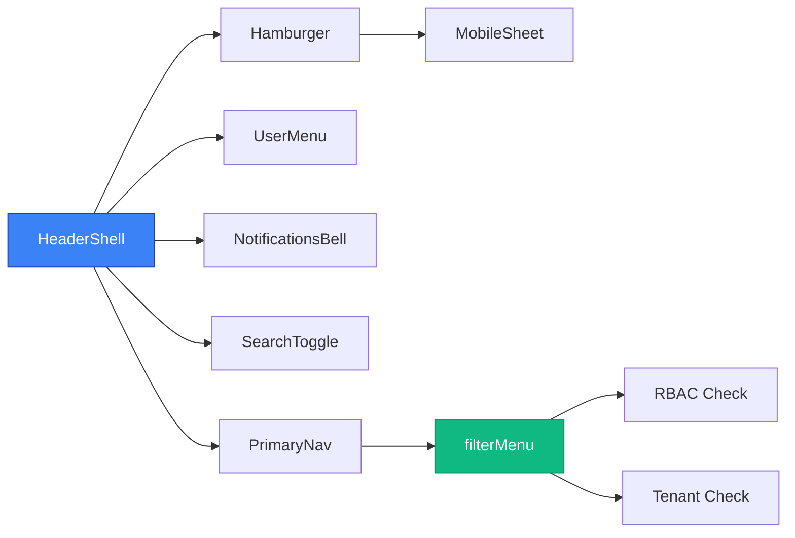

# Header Component Guide

## Overview

The Header component is a reusable, config-driven navigation system that provides:
- **Responsive design** (desktop full nav, mobile hamburger)
- **Theme support** (light/dark modes)
- **RBAC integration** (role-based menu visibility)
- **Tenancy isolation** (tenant-specific menu items)
- **Accessibility** (WCAG 2.1 AA compliance)
- **Performance** (lazy loading, memoization)

## Architecture



## Components

### HeaderShell

The main container component that orchestrates all header functionality.

```tsx
import { HeaderShell } from '@/components/ui/header/HeaderShell';

<HeaderShell
  theme="light"
  size="md"
  sticky={true}
  condensedOnScroll={true}
  logo={<Logo />}
  primaryNav={<PrimaryNav items={menuItems} />}
  secondaryActions={<SearchToggle />}
  userMenu={<UserMenu user={user} />}
  notifications={<NotificationsBell />}
  breadcrumbs={<Breadcrumbs />}
/>
```

#### Props

| Prop | Type | Default | Description |
|------|------|---------|-------------|
| `theme` | `'light' \| 'dark'` | `'light'` | Theme mode |
| `size` | `'sm' \| 'md' \| 'lg'` | `'md'` | Header size |
| `sticky` | `boolean` | `true` | Sticky positioning |
| `condensedOnScroll` | `boolean` | `true` | Condense on scroll |
| `withBorder` | `boolean` | `true` | Show bottom border |
| `logo` | `ReactNode` | - | Logo component |
| `primaryNav` | `ReactNode` | - | Primary navigation |
| `secondaryActions` | `ReactNode` | - | Secondary actions |
| `userMenu` | `ReactNode` | - | User menu |
| `notifications` | `ReactNode` | - | Notifications |
| `breadcrumbs` | `ReactNode` | - | Breadcrumbs |

### PrimaryNav

Navigation component with RBAC and tenancy filtering.

```tsx
import { PrimaryNav } from '@/components/ui/header/PrimaryNav';

<PrimaryNav
  items={menuItems}
  currentUser={user}
  mobile={false}
/>
```

#### Menu Item Structure

```typescript
interface NavItem {
  id: string;
  label: string;
  icon?: string;
  to: string;
  roles?: string[];
  tenants?: string[];
  children?: NavItem[];
  badge?: {
    text: string;
    variant?: 'default' | 'success' | 'warning' | 'error';
  };
}
```

### UserMenu

User dropdown menu with profile and settings links.

```tsx
import { UserMenu } from '@/components/ui/header/UserMenu';

<UserMenu
  user={user}
  onLogout={handleLogout}
  mobile={false}
/>
```

### NotificationsBell

Lazy-loaded notifications component.

```tsx
import { NotificationsBell } from '@/components/ui/header/NotificationsBell';

<NotificationsBell
  notifications={notifications}
  unreadCount={unreadCount}
  onMarkAsRead={handleMarkAsRead}
  onMarkAllAsRead={handleMarkAllAsRead}
/>
```

### SearchToggle

Lazy-loaded search component with global shortcut (Ctrl+K).

```tsx
import { SearchToggle } from '@/components/ui/header/SearchToggle';

<SearchToggle
  onSearch={handleSearch}
  placeholder="Search..."
/>
```

## Configuration

### Menu Configuration

Menu items are defined in `config/menu.json`:

```json
[
  {
    "id": "dashboard",
    "label": "Dashboard",
    "icon": "tachometer-alt",
    "to": "/app/dashboard",
    "roles": ["*"],
    "tenants": ["*"]
  },
  {
    "id": "projects",
    "label": "Projects",
    "icon": "project-diagram",
    "to": "/app/projects",
    "roles": ["admin", "pm", "member"],
    "tenants": ["*"],
    "badge": {
      "text": "3",
      "variant": "warning"
    }
  }
]
```

### Theme Configuration

Themes are configured via CSS variables in `resources/css/app.css`:

```css
:root {
  --hdr-bg: #ffffff;
  --hdr-fg: #111827;
  --hdr-border: #e5e7eb;
  --hdr-h: 72px;
  --hdr-h-condensed: 56px;
}

[data-theme="dark"] {
  --hdr-bg: #0b0f14;
  --hdr-fg: #e6e7e8;
  --hdr-border: #1f2937;
}
```

## RBAC Integration

### Role-Based Access Control

Menu items are filtered based on user roles:

```typescript
// Wildcard allows all roles
"roles": ["*"]

// Specific roles only
"roles": ["admin", "pm"]

// No roles property = visible to all authenticated users
```

### Tenant Isolation

Menu items can be restricted to specific tenants:

```typescript
// All tenants
"tenants": ["*"]

// Specific tenants only
"tenants": ["tenant1", "tenant2"]
```

### Permission Checking

The `filterMenu` function handles RBAC:

```typescript
import { filterMenu } from '@/lib/menu/filterMenu';

const visibleMenuItems = filterMenu(menuItems, user, tenant);
```

## Accessibility

### WCAG 2.1 AA Compliance

- **Keyboard Navigation**: Full keyboard support with Tab, Arrow keys, Enter, Escape
- **Screen Readers**: Proper ARIA labels, roles, and descriptions
- **Focus Management**: Visible focus indicators, focus trapping in modals
- **Color Contrast**: Minimum 4.5:1 contrast ratio
- **Semantic HTML**: Proper heading hierarchy, landmarks

### Keyboard Shortcuts

- `Tab` / `Shift+Tab`: Navigate through interactive elements
- `Enter` / `Space`: Activate buttons and links
- `Arrow Keys`: Navigate within dropdowns and menus
- `Escape`: Close modals and dropdowns
- `Ctrl+K` / `Cmd+K`: Open search overlay

### ARIA Labels

```tsx
// Navigation
<nav role="navigation" aria-label="Primary navigation">

// User menu
<button aria-expanded={isOpen} aria-haspopup="menu" aria-label="User menu">

// Notifications
<button aria-label={`Notifications${unreadCount > 0 ? `, ${unreadCount} unread` : ''}`}>

// Search
<button aria-label="Search" title="Search (Ctrl+K)">
```

## Performance

### Lazy Loading

Heavy components are lazy-loaded:

```tsx
// Notifications overlay
const NotificationsOverlay = lazy(() => import('./NotificationsOverlay'));

// Search overlay
const SearchOverlay = lazy(() => import('./SearchOverlay'));
```

### Memoization

Menu filtering is memoized to prevent unnecessary re-renders:

```typescript
const visibleMenuItems = useMemo(
  () => filterMenu(menuItems, user, tenant),
  [menuItems, user?.roles, user?.tenant_id, tenant?.id]
);
```

### Scroll Optimization

Header condensing uses `requestAnimationFrame` for smooth 60fps animations:

```typescript
const handleScroll = () => {
  if (!ticking) {
    rafRef.current = requestAnimationFrame(updateCondensedState);
    ticking = true;
  }
};
```

## Integration

### Laravel Integration

Add to your main layout:

```blade
{{-- resources/views/layouts/app.blade.php --}}
<div id="app">
    <header-component
        :user="{{ json_encode(auth()->user()) }}"
        :tenant="{{ json_encode(auth()->user()->tenant) }}"
        :menu-items="{{ json_encode($menuItems) }}"
    ></header-component>
    
    <main>
        @yield('content')
    </main>
</div>
```

### React Integration

```tsx
// App.tsx
import { HeaderShell } from '@/components/ui/header/HeaderShell';
import { PrimaryNav } from '@/components/ui/header/PrimaryNav';
import { UserMenu } from '@/components/ui/header/UserMenu';

function App() {
  const user = useAuth();
  const menuItems = useMenuItems(user);

  return (
    <div>
      <HeaderShell
        logo={<Logo />}
        primaryNav={<PrimaryNav items={menuItems} currentUser={user} />}
        userMenu={<UserMenu user={user} onLogout={handleLogout} />}
        notifications={<NotificationsBell />}
        search={<SearchToggle onSearch={handleSearch} />}
      />
      <main>
        <Routes>
          {/* Your routes */}
        </Routes>
      </main>
    </div>
  );
}
```

## Customization

### Adding New Menu Items

1. Add to `config/menu.json`:

```json
{
  "id": "new-feature",
  "label": "New Feature",
  "icon": "star",
  "to": "/app/new-feature",
  "roles": ["admin", "pm"],
  "tenants": ["*"]
}
```

2. Create the route in your router
3. The menu will automatically appear for authorized users

### Custom Themes

1. Add CSS variables to `resources/css/app.css`:

```css
[data-theme="custom"] {
  --hdr-bg: #your-color;
  --hdr-fg: #your-text-color;
  --hdr-border: #your-border-color;
}
```

2. Set theme in HeaderShell:

```tsx
<HeaderShell theme="custom" />
```

### Custom Icons

Use Font Awesome icons by specifying the icon name:

```json
{
  "icon": "your-fa-icon-name"
}
```

## Testing

### Unit Tests

```bash
# Run unit tests
npm test -- filterMenu.test.ts
npm test -- useHeaderCondense.test.ts
```

### E2E Tests

```bash
# Run E2E tests
npx playwright test header.spec.ts
```

### Manual Testing Checklist

- [ ] Responsive behavior (desktop/mobile)
- [ ] Keyboard navigation
- [ ] Screen reader compatibility
- [ ] Theme switching
- [ ] RBAC menu filtering
- [ ] Sticky and condensed behavior
- [ ] Search functionality
- [ ] Notifications
- [ ] User menu dropdown

## Troubleshooting

### Common Issues

1. **Menu items not showing**: Check user roles and tenant permissions
2. **Theme not applying**: Verify CSS variables are defined
3. **Mobile menu not working**: Check viewport meta tag
4. **Keyboard navigation broken**: Verify ARIA attributes
5. **Performance issues**: Check for unnecessary re-renders

### Debug Mode

Enable debug logging:

```typescript
// In development
localStorage.setItem('header-debug', 'true');
```

## Migration Guide

### From Old Header

1. Replace old header component with HeaderShell
2. Convert menu structure to new JSON format
3. Update user/tenant data structure
4. Test RBAC filtering
5. Verify accessibility compliance

### Breaking Changes

- Menu structure changed from nested objects to flat array
- User object now requires `roles` and `tenant_id` properties
- Theme switching now uses CSS variables instead of classes
- Mobile menu now uses sheet instead of dropdown

## Support

For issues and questions:
1. Check this documentation
2. Review test files for examples
3. Check browser console for errors
4. Verify RBAC permissions
5. Test in different browsers and devices
