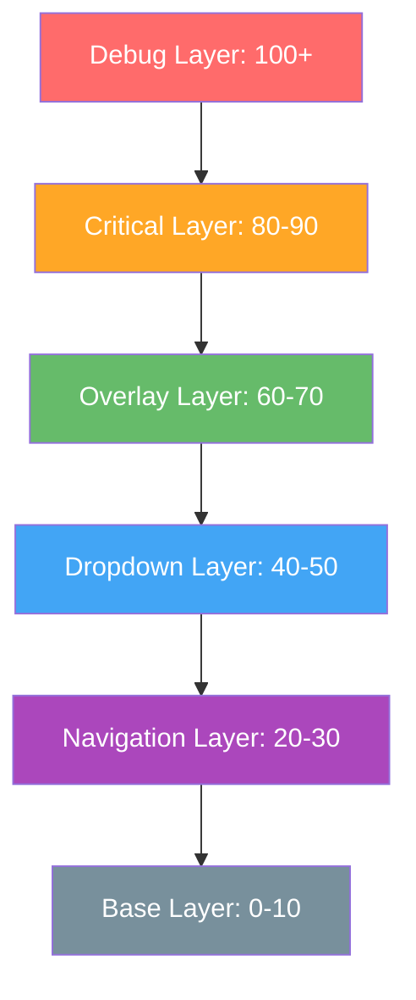

# Z-Index System Documentation

## Overview

The Z-Index System provides a standardized layering hierarchy for the entire ZenaManage application, preventing z-index conflicts and ensuring consistent UI behavior across all components.

## Problem Solved

### Before (Issues)
- Multiple components using arbitrary z-index values (z-50, z-[55], etc.)
- Z-index conflicts causing dropdown overlaps
- Inconsistent layering across different pages
- Difficult to maintain and debug

### After (Solution)
- Semantic z-index classes with clear hierarchy
- No more conflicts between components
- Consistent behavior across all pages
- Easy to maintain and extend

## Z-Index Hierarchy



## Layer Definitions

### Base Layer (0-10)
- **z-base** (0): Background elements
- **z-content** (1): Main content
- **z-elevated** (2): Slightly elevated content
- **z-sticky** (10): Sticky elements

### Navigation Layer (20-30)
- **z-nav** (20): Navigation bars
- **z-nav-sticky** (25): Sticky navigation
- **z-nav-fixed** (30): Fixed navigation

### Dropdown Layer (40-50)
- **z-dropdown** (40): Basic dropdowns
- **z-dropdown-menu** (45): Menu dropdowns
- **z-dropdown-user** (50): User menu dropdowns

### Overlay Layer (60-70)
- **z-overlay** (60): Basic overlays
- **z-modal** (65): Modal dialogs
- **z-drawer** (70): Side drawers

### Critical Layer (80-90)
- **z-critical** (80): Critical UI elements
- **z-loading** (85): Loading states
- **z-error** (90): Error states

### Debug Layer (100+)
- **z-debug** (100): Development tools
- **z-debug-panel** (100): Debug panels
- **z-debug-console** (105): Debug console

## Component-Specific Classes

### Header System
- **z-header** (30): Main header
- **z-header-dropdown** (50): Header dropdowns
- **z-admin-header** (30): Admin header
- **z-admin-dropdown** (50): Admin dropdowns

### Notification System
- **z-notification** (45): Notification dropdowns
- **z-toast** (80): Toast messages
- **z-toast-container** (85): Toast container

### Mobile System
- **z-mobile-fab** (60): Mobile FAB
- **z-mobile-nav** (70): Mobile navigation
- **z-mobile-dropdown** (65): Mobile dropdowns

### Modal System
- **z-modal-backdrop** (60): Modal backdrop
- **z-modal-content** (65): Modal content
- **z-modal-dialog** (70): Modal dialog

### Focus Mode
- **z-focus-mode** (40): Focus mode dropdown

## Usage Guidelines

### 1. Use Semantic Classes
```html
<!-- ✅ Good -->
<div class="z-header-dropdown">...</div>
<div class="z-modal-backdrop">...</div>

<!-- ❌ Bad -->
<div class="z-50">...</div>
<div class="z-[55]">...</div>
```

### 2. Follow Hierarchy
- Base elements: z-base to z-sticky
- Navigation: z-nav to z-nav-fixed
- Dropdowns: z-dropdown to z-dropdown-user
- Overlays: z-overlay to z-drawer
- Critical: z-critical to z-error
- Debug: z-debug to z-debug-console

### 3. Component-Specific Usage
```html
<!-- Header dropdowns -->
<div class="z-header-dropdown">...</div>

<!-- Admin dropdowns -->
<div class="z-admin-dropdown">...</div>

<!-- Mobile navigation -->
<div class="z-mobile-nav">...</div>

<!-- Modal system -->
<div class="z-modal-backdrop">...</div>
<div class="z-modal-content">...</div>
```

## Implementation

### CSS Classes
All z-index classes are defined in `resources/css/z-index-system.css`:

```css
.z-header { z-index: 30; }
.z-header-dropdown { z-index: 50; }
.z-notification { z-index: 45; }
.z-focus-mode { z-index: 40; }
/* ... */
```

### Tailwind Integration
Classes are also available in Tailwind config:

```typescript
// tailwind.config.ts
zIndex: {
  'header': '30',
  'header-dropdown': '50',
  'notification': '45',
  'focus-mode': '40',
  // ...
}
```

## Migration Guide

### From Arbitrary Values
```html
<!-- Before -->
<div class="z-50">...</div>
<div class="z-[55]">...</div>

<!-- After -->
<div class="z-header-dropdown">...</div>
<div class="z-notification">...</div>
```

### From Hardcoded Values
```html
<!-- Before -->
<div style="z-index: 50;">...</div>

<!-- After -->
<div class="z-header-dropdown">...</div>
```

## Best Practices

### 1. Use Semantic Names
- Choose classes that describe the component's purpose
- Avoid arbitrary numbers
- Use consistent naming patterns

### 2. Respect Hierarchy
- Don't skip layers
- Use appropriate layer for component type
- Consider stacking context

### 3. Test Interactions
- Test dropdown combinations
- Verify modal behavior
- Check mobile responsiveness

### 4. Document Changes
- Update this documentation
- Add comments for complex cases
- Explain layer choices

## Troubleshooting

### Common Issues

1. **Dropdown Still Overlapping**
   - Check if using correct semantic class
   - Verify stacking context
   - Ensure proper click-away handling

2. **Modal Behind Other Elements**
   - Use z-modal-backdrop and z-modal-content
   - Check for conflicting z-index values
   - Verify modal is in correct DOM position

3. **Mobile Navigation Issues**
   - Use z-mobile-nav for mobile navigation
   - Check responsive breakpoints
   - Verify touch event handling

### Debug Tools

```css
/* Add to debug z-index issues */
.debug-z-index * {
    outline: 1px solid red;
    outline-offset: -1px;
}

.debug-z-index [class*="z-"] {
    outline: 2px solid blue;
    outline-offset: -2px;
}
```

## Future Considerations

### 1. CSS Container Queries
- Consider container-based z-index
- Implement responsive z-index
- Support for nested contexts

### 2. CSS Layers
- Migrate to CSS @layer when supported
- Implement layer-based architecture
- Improve cascade management

### 3. Performance
- Minimize z-index calculations
- Use transform3d for hardware acceleration
- Optimize for mobile devices

## Examples

### Header with Dropdowns
```html
<header class="z-header">
    <div class="relative">
        <button>User Menu</button>
        <div class="z-header-dropdown">...</div>
    </div>
    <div class="relative">
        <button>Notifications</button>
        <div class="z-notification">...</div>
    </div>
</header>
```

### Modal System
```html
<div class="z-modal-backdrop">
    <div class="z-modal-content">
        <div class="z-modal-dialog">...</div>
    </div>
</div>
```

### Mobile Navigation
```html
<div class="z-mobile-nav">
    <div class="z-mobile-dropdown">...</div>
</div>
```

## Maintenance

### Regular Tasks
- Audit z-index usage monthly
- Update documentation for new components
- Test cross-browser compatibility
- Verify responsive behavior

### Version Control
- Document z-index changes in commits
- Include before/after examples
- Test with all component combinations
- Update this documentation

## Support

For z-index issues:
1. Check this documentation
2. Verify semantic class usage
3. Test component interactions
4. Check browser developer tools
5. Review stacking context
