# 📊 **ZENAMANAGE ARCHITECTURE DIAGRAMS**

## 📋 **OVERVIEW**

This document contains comprehensive Mermaid diagrams documenting the ZenaManage system architecture, data flow, and component relationships.

## 🏗️ **SYSTEM ARCHITECTURE**

### **High-Level Architecture**
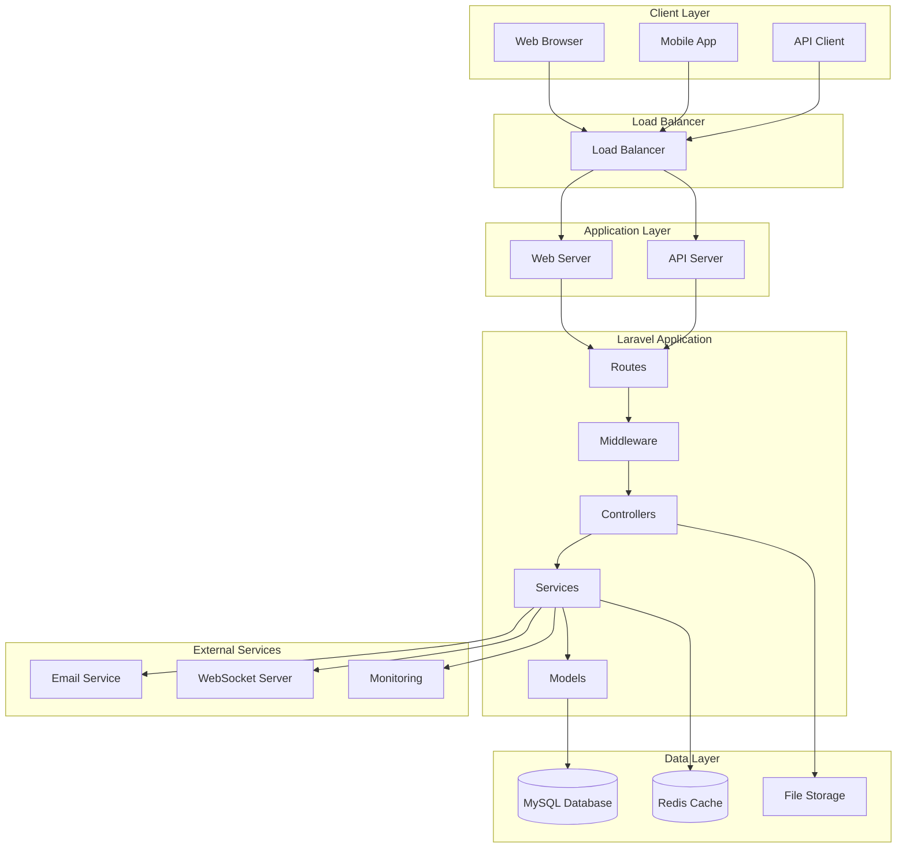

## 🔄 **REQUEST FLOW**

### **API Request Flow**
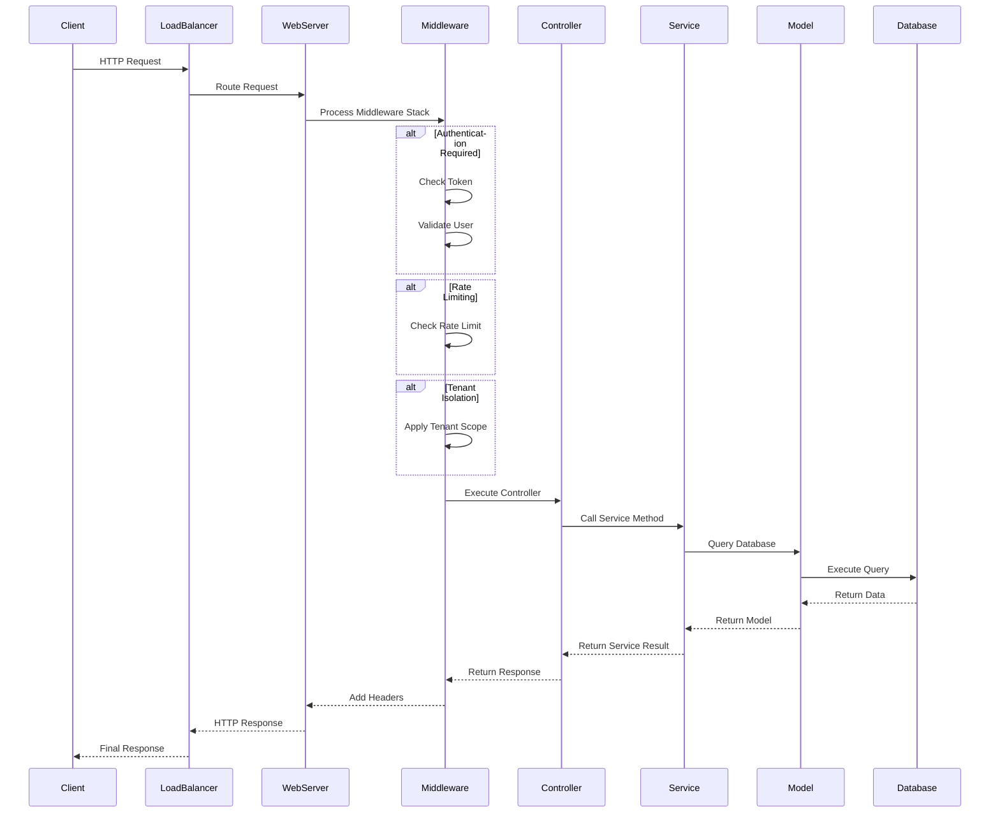

## 🏢 **MULTI-TENANT ARCHITECTURE**

### **Tenant Isolation Flow**
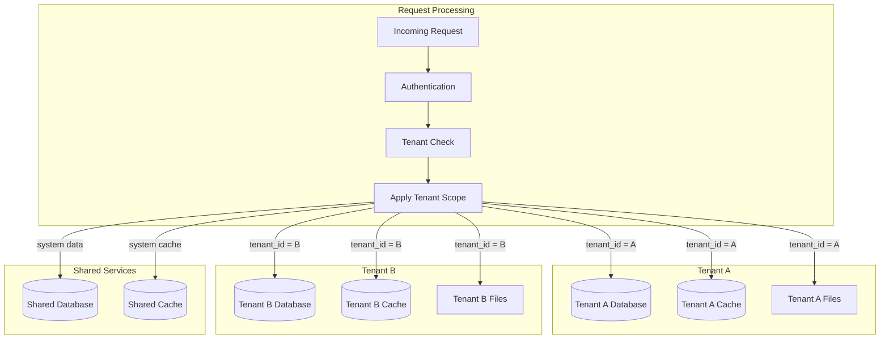

## 🔐 **AUTHENTICATION & AUTHORIZATION**

### **RBAC Flow**
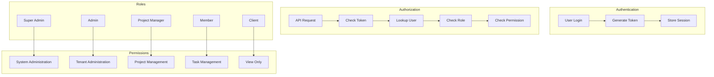

## 📊 **DASHBOARD DATA FLOW**

### **Dashboard Data Processing**
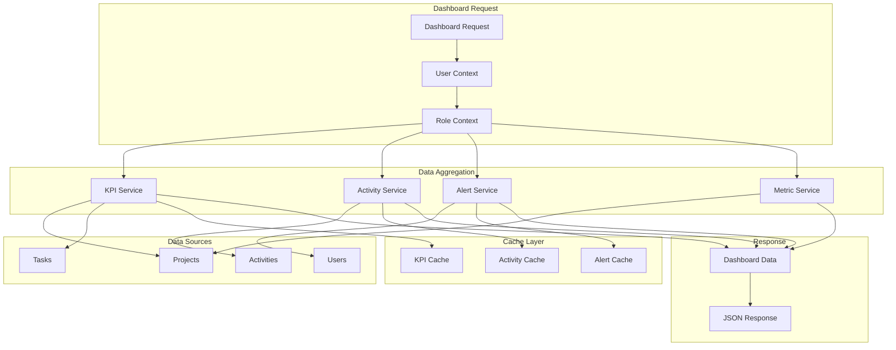

## 🔄 **LEGACY ROUTE MIGRATION**

### **3-Phase Migration Flow**
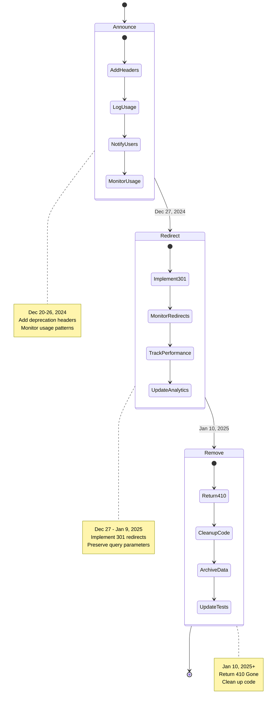

## 🧪 **TESTING ARCHITECTURE**

### **Test Pyramid**
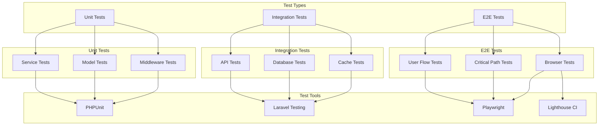

## 📈 **PERFORMANCE MONITORING**

### **Performance Monitoring Flow**
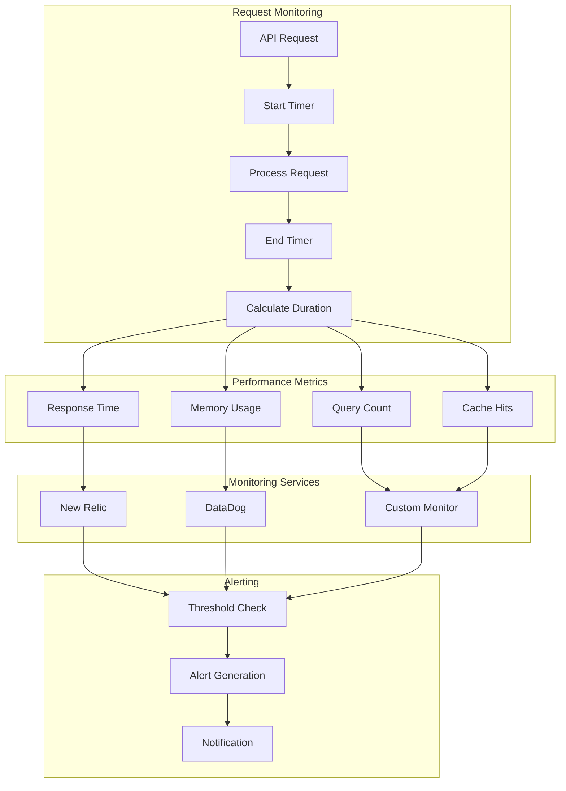

## 🔧 **CI/CD PIPELINE**

### **Deployment Pipeline**
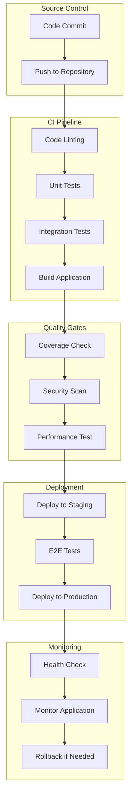

## 📱 **PAGE TREE STRUCTURE**

### **Application Page Structure**
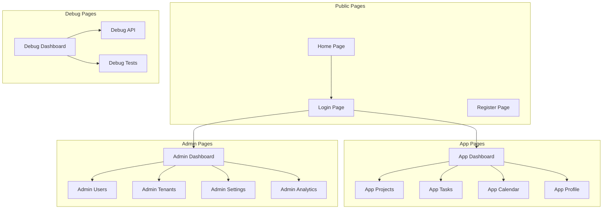

## 🔄 **ERROR HANDLING FLOW**

### **Error Processing Pipeline**
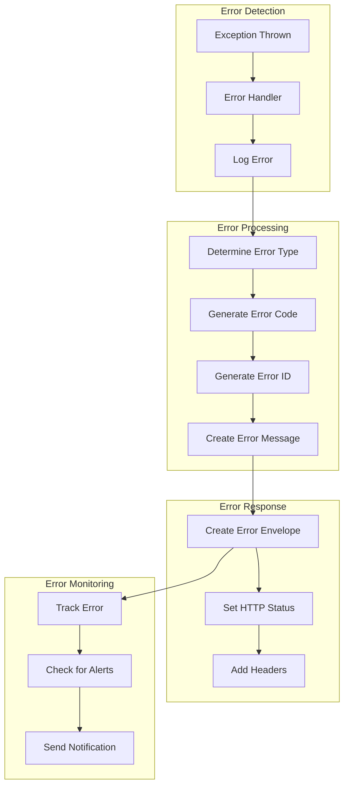

---

**Last Updated:** December 19, 2024  
**Version:** 1.0  
**Maintainer:** ZenaManage Development Team
