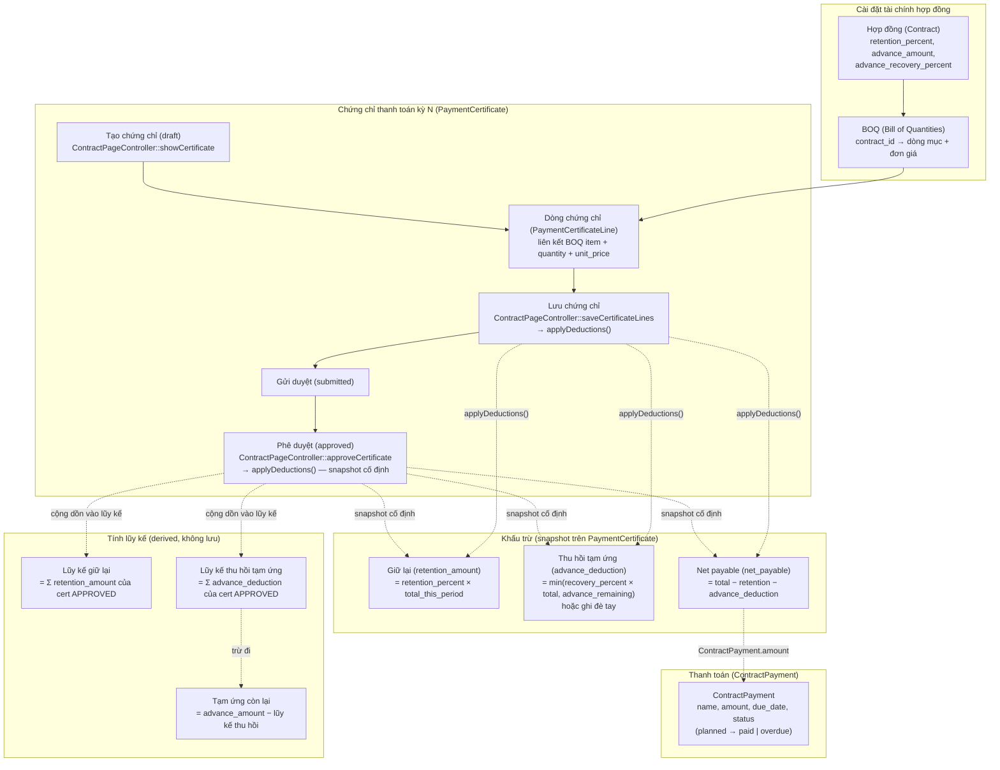

# Luồng Tài chính Hợp đồng (Contract Finance Flow)

> Sơ đồ sống cho debug: BOQ → Chứng chỉ kỳ → Khấu trừ (snapshot) → Net payable → ContractPayment.
> Ranh giới lớp được enforce bởi `composer deptrac`.

## Luồng nghiệp vụ

## Bất biến cần nhớ khi debug

1. **Snapshot không đổi khi config đổi**: `retention_amount`, `advance_deduction`, `net_payable` trên `PaymentCertificate` chỉ được tính tại thời điểm `saveCertificateLines` hoặc `approveCertificate`. Nếu admin thay đổi `retention_percent` trên Contract sau đó, các chứng chỉ đã lưu **không thay đổi**.

2. **Lũy kế chỉ tính cert APPROVED**: `cumulativeRetention` và `cumulativeAdvanceDeduction` trong controller chỉ sum các chứng chỉ có `status = 'approved'`. Chứng chỉ draft/submitted không ảnh hưởng lũy kế.

3. **Advance remaining không bao giờ âm**: `max($advanceRemaining, 0)` — nếu đã thu hồi hết thì advance_remaining = 0, không âm.

4. **Validation nghiêm ngặt**: `advance_deduction` phải từ 0 đến `advance_remaining`. Tổng `retention + advance_deduction` không vượt `total_this_period`.

5. **Web controllers chỉ delegate**: `ContractPageController` chứa logic tính khấu trừ nhưng **không chứa business logic riêng** — nó gọi trực tiếp Eloquent queries. API controllers (`ContractController`, `ContractPaymentController`) xử lý CRUD thuần.

## Models tham gia

| Model | Bảng | Vai trò |
|-------|------|---------|
| `Contract` | `contracts` | Hợp đồng — chứa config tài chính (retention%, advance, recovery%) |
| `Boq` | `boqs` | Bill of Quantities — linked 1:1 với Contract |
| `PaymentCertificate` | `payment_certificates` | Chứng chỉ kỳ — snapshot khấu trừ tại thời điểm duyệt |
| `PaymentCertificateLine` | `payment_certificate_lines` | Dòng chứng chỉ — linked BOQ item |
| `ContractPayment` | `contract_payments` | Lịch thanh toán — planned/paid/overdue |

## Controller ownership

| Controller | Route | Vai trò |
|------------|-------|---------|
| `Web\ContractPageController` | `/contracts/{id}` | Hiển thị + xử lý finance settings + chứng chỉ (applyDeductions) |
| `Api\ContractController` | `/api/v1/projects/{project}/contracts` | CRUD hợp đồng (API) |
| `Api\ContractPaymentController` | `/api/v1/contracts/{contract}/payments` | CRUD thanh toán (API) |
