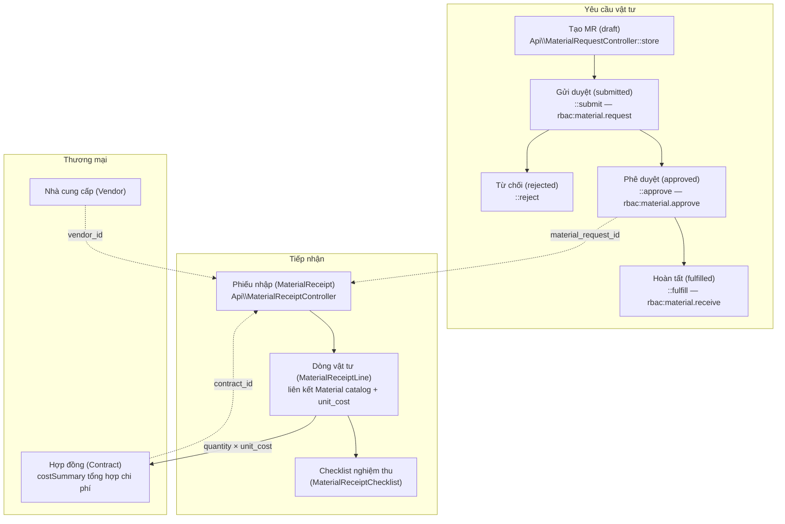

# Luồng Mua sắm (Procurement) — Material Request → Receipt → Cost

> Sơ đồ sống cho debug: mỗi node ghi rõ controller/model sở hữu.
> Ranh giới lớp được enforce bởi `composer deptrac`.

## Luồng nghiệp vụ

## Bất biến cần nhớ khi debug

- **Trạng thái MR chỉ đi một chiều**: draft → submitted → (approved|rejected); approved → fulfilled. Controller chặn ở từng bước.
- **Tenant scope**: MR scope qua `whereHas('project', tenant_id)`; Receipt/Vendor/Contract có cột `tenant_id` trực tiếp.
- Web page controllers (`Web\MaterialRequestPageController`, `Web\ReceiptPageController`) chỉ **delegate** sang Api controllers — không chứa business logic.
- RBAC nằm ở **route level** (`rbac:material.*`), API controllers dùng thêm Policy (`authorize()`).
