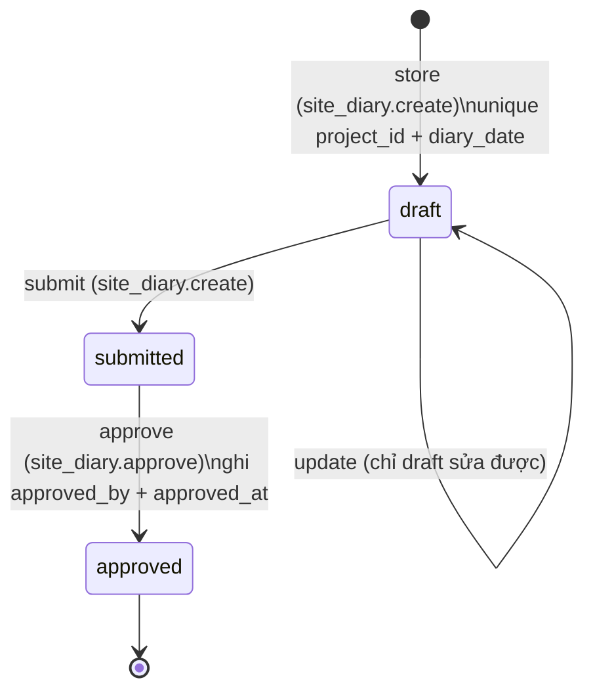
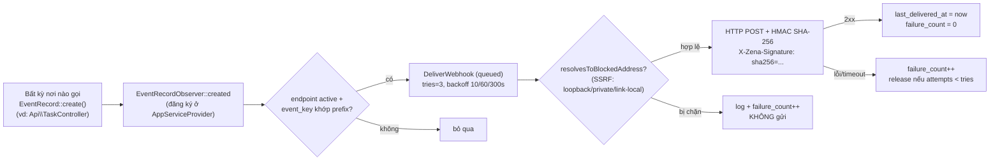

# Luồng Site Ops & Event/Webhook — Nhật ký công trường, EventRecord outbox

> Sơ đồ sống cho debug. Ranh giới lớp enforce bởi `composer deptrac`.

## Nhật ký công trường (Site Diary)

- Controller: `Api\SiteDiaryController`; web delegate: `Web\SiteDiaryPageController`.
- Race tạo trùng ngày: DB unique constraint là nguồn chân lý — `QueryException 23000` → 422.

## EventRecord outbox → Webhook delivery

## Bất biến cần nhớ khi debug

- Observer chạy **trong request** tạo EventRecord; job giao webhook chạy qua **queue** — production bắt buộc `QUEUE_CONNECTION != sync`.
- SSRF chặn 2 lớp: lúc tạo endpoint (`WebhookPageController` validation) và lúc giao (chống DNS rebinding).
- Secret webhook chỉ hiển thị 1 lần qua flash key riêng `one_time_secret` — không đi qua flash `success` chung.
- Activity Feed (`/operator/activity-feed`) đọc trực tiếp bảng `event_records` — nếu feed trống nghĩa là nơi phát nghiệp vụ chưa gọi `EventRecord::create()`.
