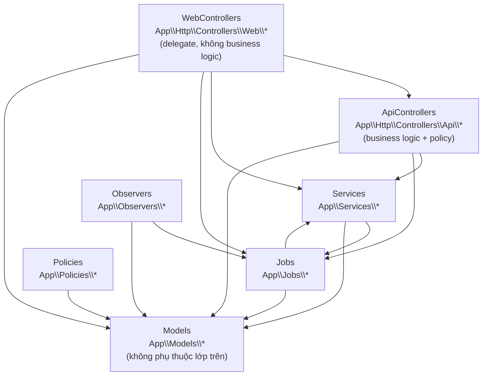

# Bản đồ phân lớp (Layer Map) — enforce bởi Deptrac

> Đây không phải hình vẽ tham khảo: mọi mũi tên dưới đây là **rule thực thi được**.
> Vi phạm mới → `composer deptrac` fail. Cấu hình tại `deptrac.yaml`.

## Nợ kỹ thuật đã baseline (không thêm mới)

| Vi phạm | Ghi chú |
|---|---|
| `Models\Task` → `Services\TaskDependencyService` | Model gọi Service — cần tách logic dependency ra khỏi model khi refactor Task |
| `Models\ZenaTask` → `Services\TaskDependencyService` | Như trên |

## Sơ đồ luồng nghiệp vụ chi tiết

- [Procurement: Material Request → Receipt → Cost](flow-procurement.md)
- [Site Ops: Site Diary + EventRecord → Webhook](flow-site-ops-events.md)
- Route/module ownership: [module-ownership-ssot.md](module-ownership-ssot.md)
