# 🌳 ZENAMANAGE SYSTEM - PAGE TREE DIAGRAM (CURRENT STATE)

## 📋 OVERVIEW
Sơ đồ mối quan hệ cha-con của toàn bộ hệ thống ZenaManage Project Management System đến thời điểm hiện tại (sau khi hoàn thành Admin Dashboard và Tasks Management).

**📅 Cập nhật lần cuối:** 2025-01-15  
**🔄 Phiên bản:** 3.0 - Current State  
**✅ Trạng thái:** Admin Dashboard hoàn thành, Tasks Management đã tích hợp

---

## 🌳 COMPLETE PAGE TREE STRUCTURE (CURRENT STATE)

```mermaid
graph TD
    %% Root Level
    ROOT["🏠 ZenaManage System<br/>Root Domain"]
    
    %% Authentication Level
    ROOT --> AUTH["🔐 Authentication (2 trang)"]
    AUTH --> LOGIN["/login<br/>Login Page"]
    AUTH --> LOGOUT["/logout<br/>Logout"]
    
    %% Admin Routes (Super Admin Only) - COMPLETED
    ROOT --> ADMIN["👑 Admin Routes<br/>Super Admin Only"]
    ADMIN --> ADMIN_DASH["/admin<br/>✅ Admin Dashboard<br/>KPI Cards, System Status"]
    ADMIN --> ADMIN_USERS["/admin/users<br/>User Management"]
    ADMIN --> ADMIN_TENANTS["/admin/tenants<br/>Tenant Management"]
    ADMIN --> ADMIN_PROJECTS["/admin/projects<br/>System-wide Project Oversight<br/>Tenant Filter Required"]
    ADMIN --> ADMIN_TASKS["/admin/tasks<br/>✅ System-wide Task Monitoring<br/>Investigation & Intervention<br/>Breadcrumb: Admin > Tasks"]
    ADMIN --> ADMIN_SECURITY["/admin/security<br/>Security Center"]
    ADMIN --> ADMIN_ALERTS["/admin/alerts<br/>System Alerts"]
    ADMIN --> ADMIN_ACTIVITIES["/admin/activities<br/>Activity Logs"]
    ADMIN --> ADMIN_ANALYTICS["/admin/analytics<br/>Advanced Analytics"]
    ADMIN --> ADMIN_MAINTENANCE["/admin/maintenance<br/>System Maintenance"]
    ADMIN --> ADMIN_SETTINGS["/admin/settings<br/>System Settings"]
    ADMIN --> ADMIN_SIDEBAR["/admin/sidebar-builder<br/>Sidebar Builder"]
    
    %% App Routes (Tenant Users Only)
    ROOT --> APP["📱 App Routes<br/>Tenant Users Only"]
    APP --> APP_DASH["/app/dashboard<br/>Tenant Dashboard"]
    APP --> APP_PROJECTS["/app/projects<br/>Project Management"]
    APP --> APP_PROJ_CREATE["/app/projects/create<br/>Create Project"]
    APP --> APP_PROJ_SHOW["/app/projects/{project}<br/>Project Detail"]
    APP --> APP_PROJ_EDIT["/app/projects/{project}/edit<br/>Edit Project"]
    APP --> APP_PROJ_DOCS["/app/projects/{project}/documents<br/>Project Documents"]
    APP --> APP_PROJ_HISTORY["/app/projects/{project}/history<br/>Project History"]
    APP --> APP_PROJ_DESIGN["/app/projects/{project}/design<br/>Design Phase"]
    APP --> APP_PROJ_CONSTRUCTION["/app/projects/{project}/construction<br/>Construction Phase"]
    
    %% App Tasks Routes
    APP --> APP_TASKS["/app/tasks<br/>✅ My Tasks<br/>Tenant Internal Operations<br/>Breadcrumb: Dashboard > Tasks"]
    APP --> APP_TASK_CREATE["/app/tasks/create<br/>Create Task"]
    APP --> APP_TASK_SHOW["/app/tasks/{task}<br/>Task Detail"]
    APP --> APP_TASK_EDIT["/app/tasks/{task}/edit<br/>Edit Task"]
    APP --> APP_TASK_DOCS["/app/tasks/{task}/documents<br/>Task Documents"]
    APP --> APP_TASK_HISTORY["/app/tasks/{task}/history<br/>Task History"]
    
    %% App Documents Routes
    APP --> APP_DOCUMENTS["/app/documents<br/>Document Management"]
    APP --> APP_DOC_CREATE["/app/documents/create<br/>Create Document"]
    APP --> APP_DOC_APPROVALS["/app/documents/approvals<br/>Document Approvals"]
    
    %% App Team Routes
    APP --> APP_TEAM["/app/team<br/>Team Management"]
    APP --> APP_TEAM_USERS["/app/team/users<br/>Team Users"]
    APP --> APP_TEAM_INVITE["/app/team/invite<br/>Invite Team Member"]
    
    %% App Templates Routes
    APP --> APP_TEMPLATES["/app/templates<br/>Template Library"]
    APP --> APP_TEMP_CREATE["/app/templates/create<br/>Create Template"]
    APP --> APP_TEMP_SHOW["/app/templates/{template}<br/>Template Detail"]
    APP --> APP_TEMP_BUILDER["/app/templates/{template}/builder<br/>Template Builder"]
    APP --> APP_TEMP_CONSTRUCTION["/app/templates/{template}/construction<br/>Template Construction"]
    APP --> APP_TEMP_ANALYTICS["/app/templates/{template}/analytics<br/>Template Analytics"]
    
    %% App Settings Routes
    APP --> APP_SETTINGS["/app/settings<br/>Account Settings"]
    APP --> APP_SETTINGS_GENERAL["/app/settings/general<br/>General Settings"]
    APP --> APP_SETTINGS_SECURITY["/app/settings/security<br/>Security Settings"]
    APP --> APP_SETTINGS_NOTIFICATIONS["/app/settings/notifications<br/>Notification Settings"]
    APP --> APP_PROFILE["/app/profile<br/>User Profile"]
    
    %% API Routes
    ROOT --> API["🔌 API Routes<br/>RESTful API"]
    API --> API_V1["/api/v1<br/>API Version 1"]
    API_V1 --> API_ADMIN["/api/v1/admin<br/>Admin API"]
    API_V1 --> API_APP["/api/v1/app<br/>App API"]
    API_V1 --> API_PUBLIC["/api/v1/public<br/>✅ Public API<br/>Health Check"]
    API_V1 --> API_AUTH["/api/v1/auth<br/>Auth API"]
    API_V1 --> API_INVITATIONS["/api/v1/invitations<br/>Invitation API"]
    API_V1 --> API_TASKS["/api/v1/app/tasks<br/>✅ Tasks API<br/>CRUD + Move + Archive"]
    API_V1 --> API_PROJECTS["/api/v1/app/projects<br/>✅ Projects API<br/>CRUD + Metrics + History"]
    API_V1 --> API_CALENDAR["/api/v1/app/calendar<br/>✅ Calendar API<br/>Events + Tenant-scoped"]
    API_V1 --> API_ADMIN_PERF["/api/v1/admin/perf<br/>✅ Admin Performance API<br/>Metrics + Health + Cache"]
    
    API_PUBLIC --> API_PUBLIC_HEALTH["GET /api/v1/public/health<br/>✅ Public Liveness Check<br/>throttle:public"]
    
    API_ADMIN_PERF --> API_ADMIN_METRICS["GET /api/v1/admin/perf/metrics<br/>✅ Performance Metrics<br/>auth:sanctum + ability:admin"]
    API_ADMIN_PERF --> API_ADMIN_HEALTH["GET /api/v1/admin/perf/health<br/>✅ Admin Health Check<br/>auth:sanctum + ability:admin"]
    API_ADMIN_PERF --> API_ADMIN_CACHE["POST /api/v1/admin/perf/clear-caches<br/>✅ Clear Caches<br/>auth:sanctum + ability:admin"]
    
    API_TASKS --> API_TASK_MOVE["PATCH /api/v1/app/tasks/{id}/move<br/>Move Task API"]
    API_TASKS --> API_TASK_ARCHIVE["PATCH /api/v1/app/tasks/{id}/archive<br/>Archive Task API"]
    
    API_PROJECTS --> API_PROJ_METRICS["GET /api/v1/app/projects/metrics<br/>KPI 4 thẻ portfolio"]
    API_PROJECTS --> API_PROJ_LIST["GET /api/v1/app/projects<br/>List + Filters + Pagination + Sort"]
    API_PROJ_LIST --> API_PROJ_CREATE["POST /api/v1/app/projects<br/>Create Project"]
    API_PROJ_LIST --> API_PROJ_SHOW["GET /api/v1/app/projects/{id}<br/>Project Details"]
    API_PROJ_LIST --> API_PROJ_UPDATE["PATCH /api/v1/app/projects/{id}<br/>Status/Health/Budget Updates"]
    API_PROJ_LIST --> API_PROJ_DELETE["DELETE /api/v1/app/projects/{id}<br/>Delete Project"]
    API_PROJ_LIST --> API_PROJ_HISTORY["GET /api/v1/app/projects/{id}/history<br/>Project History (Audit Trail)"]
    
    API_CALENDAR --> API_CAL_LIST["GET /api/v1/app/calendar<br/>Events by Date Range"]
    API_CALENDAR --> API_CAL_CREATE["POST /api/v1/app/calendar<br/>Create Event"]
    API_CALENDAR --> API_CAL_UPDATE["PUT /api/v1/app/calendar/{id}<br/>Update Event"]
    API_CALENDAR --> API_CAL_DELETE["DELETE /api/v1/app/calendar/{id}<br/>Delete Event"]
    API_CALENDAR --> API_CAL_UPCOMING["GET /api/v1/app/calendar/upcoming<br/>Upcoming Events"]
    
    %% Debug Routes (OPTIMIZED - Moved from root)
    ROOT --> DEBUG["🐛 Debug Routes<br/>OPTIMIZED - DebugGate Protected"]
    DEBUG --> DEBUG_INFO["/_debug/info<br/>System Information"]
    DEBUG --> DEBUG_PROJECTS["/_debug/projects-test<br/>Project Testing"]
    DEBUG --> DEBUG_USERS["/_debug/users-debug<br/>User Debugging"]
    DEBUG --> DEBUG_TASKS["/_debug/tasks-debug<br/>Task Debugging"]
    DEBUG --> DEBUG_FRONTEND["/_debug/frontend-test<br/>Frontend Testing"]
    DEBUG --> DEBUG_LOGIN["/_debug/login-test<br/>Login Testing"]
    DEBUG --> DEBUG_SIMPLE["/_debug/simple-test<br/>Simple Testing"]
    DEBUG --> DEBUG_NAV["/_debug/navigation-test<br/>Navigation Testing"]
    DEBUG --> DEBUG_DASHBOARD_DATA["✅ /_debug/dashboard-data<br/>Dashboard Data Test<br/>DebugGate Protected"]
    DEBUG --> DEBUG_API_DOCS["✅ /_debug/api-docs<br/>API Documentation<br/>DebugGate Protected"]
    DEBUG --> DEBUG_TEST_PERMISSIONS["✅ /_debug/test-permissions<br/>Permission Testing<br/>DebugGate Protected"]
    DEBUG --> DEBUG_TEST_LOGIN_SIMPLE["✅ /_debug/test-login-simple<br/>Simple Login Testing<br/>DebugGate Protected"]
    DEBUG --> DEBUG_TEST_SESSION_AUTH["✅ /_debug/test-session-auth<br/>Session Auth Testing<br/>DebugGate Protected"]
    DEBUG --> DEBUG_TEST_LOGIN_EMAIL["✅ /_debug/test-login/{email}<br/>Debug Login with Email<br/>DebugGate Protected"]
    DEBUG --> DEBUG_MOVED["❌ MOVED FROM ROOT<br/>4 routes moved to /_debug"]
    DEBUG_MOVED --> DEBUG_MOVED_DASHBOARD["❌ /dashboard-data<br/>MOVED TO /_debug/dashboard-data"]
    DEBUG_MOVED --> DEBUG_MOVED_API_DOCS["❌ /api-docs<br/>MOVED TO /_debug/api-docs"]
    DEBUG_MOVED --> DEBUG_MOVED_TEST_ADMIN["❌ /test-api-admin-dashboard<br/>MOVED TO /_debug/test-api-admin-dashboard"]
    DEBUG_MOVED --> DEBUG_MOVED_API_DOCS_JSON["❌ /api-docs.json<br/>MOVED TO /_debug/api-docs.json"]
    
    %% Legacy Routes (OPTIMIZED - 3-Phase Strategy)
    ROOT --> LEGACY["🔄 Legacy Routes<br/>OPTIMIZED - 12 Routes Total"]
    LEGACY --> LEGACY_ESSENTIAL["✅ Essential Routes (3)<br/>High/Medium Traffic"]
    LEGACY_ESSENTIAL --> LEGACY_DASH["✅ /dashboard → /app/dashboard<br/>Essential - High Traffic"]
    LEGACY_ESSENTIAL --> LEGACY_PROJECTS["✅ /projects → /app/projects<br/>Essential - High Traffic"]
    LEGACY_ESSENTIAL --> LEGACY_TASKS["✅ /tasks → /app/tasks<br/>Essential - Medium Traffic"]
    
    LEGACY --> LEGACY_PERFORMANCE["✅ Performance Routes (7)<br/>Moved to API"]
    LEGACY_PERFORMANCE --> LEGACY_HEALTH["/health → /api/v1/public/health"]
    LEGACY_PERFORMANCE --> LEGACY_METRICS["/metrics → /api/v1/admin/perf/metrics"]
    LEGACY_PERFORMANCE --> LEGACY_HEALTH_CHECK["/health-check → /api/v1/admin/perf/health"]
    LEGACY_PERFORMANCE --> LEGACY_CLEAR_CACHE["/clear-cache → /api/v1/admin/perf/clear-caches"]
    LEGACY_PERFORMANCE --> LEGACY_PERF_METRICS["/performance/metrics → /api/v1/admin/perf/metrics"]
    LEGACY_PERFORMANCE --> LEGACY_PERF_HEALTH["/performance/health → /api/v1/admin/perf/health"]
    LEGACY_PERFORMANCE --> LEGACY_PERF_CLEAR["/performance/clear-caches → /api/v1/admin/perf/clear-caches"]
    
    LEGACY --> LEGACY_INVITATION["📅 Invitation Routes (2)<br/>2025-03-21 to 2025-04-21<br/>410 Removal: 2025-05-21"]
    LEGACY_INVITATION --> LEGACY_INVITE_ACCEPT["/invite/accept/{token} → /invitations/accept/{token}"]
    LEGACY_INVITATION --> LEGACY_INVITE_DECLINE["/invite/decline/{token} → /invitations/decline/{token}"]
    
    LEGACY --> LEGACY_REMOVED["❌ REMOVED (9 routes)<br/>Low/Very Low Traffic"]
    LEGACY_REMOVED --> LEGACY_USERS["❌ /users<br/>REMOVED - Low Traffic"]
    LEGACY_REMOVED --> LEGACY_TENANTS["❌ /tenants<br/>REMOVED - Low Traffic"]
    LEGACY_REMOVED --> LEGACY_DOCUMENTS["❌ /documents<br/>REMOVED - Low Traffic"]
    LEGACY_REMOVED --> LEGACY_TEMPLATES["❌ /templates<br/>REMOVED - Low Traffic"]
    LEGACY_REMOVED --> LEGACY_SETTINGS["❌ /settings<br/>REMOVED - Low Traffic"]
    LEGACY_REMOVED --> LEGACY_PROFILE["❌ /profile<br/>REMOVED - Low Traffic"]
    LEGACY_REMOVED --> LEGACY_TEAM["❌ /team<br/>REMOVED - Low Traffic"]
    LEGACY_REMOVED --> LEGACY_ADMIN["❌ /admin-dashboard<br/>REMOVED - Very Low Traffic"]
    LEGACY_REMOVED --> LEGACY_ROLE["❌ /role-dashboard<br/>REMOVED - Very Low Traffic"]
    
    %% Performance & Monitoring Routes (MOVED TO API)
    ROOT --> PERF["📊 Performance & Monitoring<br/>❌ MOVED TO API"]
    PERF --> PERF_HEALTH["❌ /health<br/>MOVED TO /api/v1/public/health"]
    PERF --> PERF_METRICS["❌ /metrics<br/>MOVED TO /api/v1/admin/perf/metrics"]
    PERF --> PERF_HEALTH_CHECK["❌ /health-check<br/>MOVED TO /api/v1/admin/perf/health"]
    PERF --> PERF_CLEAR_CACHE["❌ /clear-cache<br/>MOVED TO /api/v1/admin/perf/clear-caches"]
    
    %% Invitation Routes
    ROOT --> INVITATIONS["📧 Invitations"]
    INVITATIONS --> INVITE_ACCEPT["✅ /invitations/accept/{token}<br/>Accept Invitation"]
    INVITATIONS --> INVITE_DECLINE["✅ /invitations/decline/{token}<br/>Decline Invitation"]
    INVITATIONS --> INVITE_LEGACY_ACCEPT["❌ /invite/accept/{token}<br/>LEGACY - Redirects to /invitations/accept/{token}"]
    INVITATIONS --> INVITE_LEGACY_DECLINE["❌ /invite/decline/{token}<br/>LEGACY - Redirects to /invitations/decline/{token}"]
    
    %% Calendar Routes (Tenant-scoped)
    APP --> APP_CALENDAR["/app/calendar<br/>Tenant Calendar<br/>Project & Task Scheduling"]
    
    %% Styling
    classDef adminRoute fill:#e1f5fe,stroke:#01579b,stroke-width:2px,color:#000
    classDef appRoute fill:#f3e5f5,stroke:#4a148c,stroke-width:2px,color:#000
    classDef apiRoute fill:#e8f5e8,stroke:#1b5e20,stroke-width:2px,color:#000
    classDef debugRoute fill:#fff3e0,stroke:#e65100,stroke-width:2px,color:#000
    classDef legacyRoute fill:#fce4ec,stroke:#880e4f,stroke-width:2px,color:#000
    classDef perfRoute fill:#f1f8e9,stroke:#33691e,stroke-width:2px,color:#000
    classDef completedRoute fill:#c8e6c9,stroke:#2e7d32,stroke-width:3px,color:#000
    
    %% Apply styling
    class ADMIN,ADMIN_DASH,ADMIN_USERS,ADMIN_TENANTS,ADMIN_PROJECTS,ADMIN_TASKS,ADMIN_SECURITY,ADMIN_ALERTS,ADMIN_ACTIVITIES,ADMIN_ANALYTICS,ADMIN_MAINTENANCE,ADMIN_SETTINGS,ADMIN_SIDEBAR adminRoute
    class APP,APP_DASH,APP_PROJECTS,APP_PROJ_CREATE,APP_PROJ_SHOW,APP_PROJ_EDIT,APP_PROJ_DOCS,APP_PROJ_HISTORY,APP_PROJ_DESIGN,APP_PROJ_CONSTRUCTION,APP_TASKS,APP_TASK_CREATE,APP_TASK_SHOW,APP_TASK_EDIT,APP_TASK_DOCS,APP_TASK_HISTORY,APP_CALENDAR,APP_DOCUMENTS,APP_DOC_CREATE,APP_DOC_APPROVALS,APP_TEAM,APP_TEAM_USERS,APP_TEAM_INVITE,APP_TEMPLATES,APP_TEMP_CREATE,APP_TEMP_SHOW,APP_TEMP_BUILDER,APP_TEMP_CONSTRUCTION,APP_TEMP_ANALYTICS,APP_SETTINGS,APP_SETTINGS_GENERAL,APP_SETTINGS_SECURITY,APP_SETTINGS_NOTIFICATIONS,APP_PROFILE appRoute
    class API,API_V1,API_ADMIN,API_APP,API_PUBLIC,API_AUTH,API_INVITATIONS,API_TASKS,API_PROJECTS,API_CALENDAR,API_ADMIN_PERF apiRoute
    class DEBUG,DEBUG_INFO,DEBUG_PROJECTS,DEBUG_USERS,DEBUG_TASKS,DEBUG_FRONTEND,DEBUG_LOGIN,DEBUG_SIMPLE,DEBUG_NAV debugRoute
    class LEGACY,LEGACY_DASH,LEGACY_ADMIN,LEGACY_ROLE,LEGACY_PROJECTS,LEGACY_TASKS,LEGACY_USERS,LEGACY_TENANTS,LEGACY_DOCUMENTS,LEGACY_TEMPLATES,LEGACY_SETTINGS,LEGACY_PROFILE,LEGACY_CALENDAR,LEGACY_TEAM,LEGACY_DEBUG legacyRoute
    class PERF,PERF_HEALTH,PERF_METRICS,PERF_HEALTH_CHECK,PERF_CLEAR_CACHE perfRoute
    class ADMIN_DASH,ADMIN_TASKS completedRoute
```



---

## 📊 **THỐNG KÊ HỆ THỐNG HIỆN TẠI**

### **🎯 CẤU TRÚC CHÍNH:**

#### **🏠 ROOT LEVEL:**
- **ZenaManage System** - Gốc của toàn bộ hệ thống

#### **📊 CÁC MODULE CHÍNH:**

1. **🔐 Authentication (3 trang)**
   - Login, Logout, Debug Login

2. **👑 Admin Routes (12 trang) - ✅ HOÀN THÀNH**
   - ✅ **Admin Dashboard** - KPI Cards, System Status, Quick Actions
   - ✅ **System-wide Task Monitoring** - Investigation & Intervention, Tenant Filter Required
   - User Management, Tenant Management, Project Oversight
   - Security Center, System Alerts, Activity Logs
   - Advanced Analytics, System Maintenance, Settings
   - Sidebar Builder

3. **📱 App Routes (39 trang)**
   - ✅ **My Tasks** - Tenant Internal Operations, Daily Task Management
   - Tenant Dashboard + 38 Feature Pages
   - Project Management, Document Management
   - Team Management, Template Library, Settings
   - ❌ **Removed:** 2 UI routes (move, archive) - Now use API

4. **🔌 API Routes (5 nhóm + Tasks API + Performance API)**
   - Admin API, App API, Public API, Auth API, Invitation API
   - ✅ **Added:** Tasks API với Move & Archive endpoints
   - ✅ **Added:** Public Health API với throttle protection
   - ✅ **Added:** Admin Performance API với auth + admin ability
   - ✅ **Audit Logging:** Tất cả API actions được log

5. **🐛 Debug Routes (15 trang - OPTIMIZED)**
   - ✅ **Protected:** DebugGate middleware với env + IP allowlist
   - ✅ **Moved:** 4 routes từ root level vào /_debug namespace
   - ✅ **Security:** Không deploy prod nếu còn test routes ở root
   - ✅ **Benefits:** Reduced attack surface, better security

6. **🔄 Legacy Routes (12 trang - OPTIMIZED)**
   - ✅ **Essential:** /dashboard, /projects, /tasks (high/medium traffic)
   - ❌ **Removed:** 9 routes với low/very low traffic
   - ✅ **Strategy:** 3-phase removal (Announce → 301 → 410)
   - ✅ **Benefits:** Reduced maintenance burden, clearer architecture

7. **📊 Performance & Monitoring (4 trang - MOVED TO API)**
   - ❌ **Moved:** All routes moved to proper API endpoints
   - ✅ **Public:** /api/v1/public/health (throttled)
   - ✅ **Admin:** /api/v1/admin/perf/* (authenticated + admin ability)

8. **📧 Invitations (2 trang + 2 legacy redirects)**
   - ✅ **Standardized:** /invitations/accept/{token}, /invitations/decline/{token}
   - ❌ **Legacy:** /invite/* routes with 301 redirects
   - ✅ **Consistent:** Web routes match API naming convention

9. **📅 Calendar (1 trang)**
   - Tenant-scoped calendar view

### 📈 **THỐNG KÊ TỔNG QUAN:**

- **Tổng số trang:** 151+ routes (tăng từ 81+ do thêm API routes)
- **Admin Routes:** 12 routes (dashboard, users, tenants, security, alerts, activities, analytics, projects, tasks, settings, maintenance, sidebar-builder)
- **App Routes:** 25 routes (projects, tasks, documents, team, templates, settings, profile, calendar)
- **API Routes:** 19 routes (app API: 15, admin API: 4)
- **Debug Routes:** 16 routes (moved to /_debug namespace)
- **Legacy Redirects:** 30 routes (301 redirects)
- **Authentication:** 3 routes (login, logout, api-demo)
- **Other Routes:** 49 routes (projects, tasks, documents, team, templates, settings, profile, etc.)

### ✅ **TRẠNG THÁI HOÀN THÀNH:**

#### **👑 Admin Dashboard (100% Complete):**
- ✅ KPI Cards với metrics thực tế
- ✅ System Status monitoring
- ✅ Quick Actions navigation
- ✅ Recent Activity feed
- ✅ System Alerts management
- ✅ Admin Actions panel
- ✅ Performance optimization
- ✅ Professional UI/UX

#### **🔍 System-wide Task Monitoring (100% Complete):**
- ✅ **Purpose:** Investigation & Intervention across all tenants
- ✅ **Scope:** System-wide monitoring and oversight
- ✅ **Breadcrumb:** Admin > Tasks
- ✅ **Title:** "System-wide Task Monitoring"
- ✅ **Tenant Filter:** Required (All Tenants, Tenant A, B, C)
- ✅ **Priority Levels:** Critical, High, Medium, Low
- ✅ **Status Options:** Includes "Overdue" for monitoring
- ✅ **Actions:** Create System Task, Archive, Move, Delete
- ✅ **Features:** Deep investigation tools, system interventions
- ✅ **Audit Logging:** Full administrative action logging

#### **📋 My Tasks Management (100% Complete):**
- ✅ **Purpose:** Tenant Internal Operations & Daily Management
- ✅ **Scope:** Current tenant only
- ✅ **Breadcrumb:** Dashboard > Tasks
- ✅ **Title:** "My Tasks"
- ✅ **Tenant Filter:** Not applicable (tenant-scoped)
- ✅ **Priority Levels:** High, Medium, Low (no Critical)
- ✅ **Status Options:** Standard statuses (Pending, In Progress, Completed, Cancelled)
- ✅ **Actions:** Create Task, Edit, View, Complete, Delete
- ✅ **Features:** Team collaboration, project integration
- ✅ **Audit Logging:** Standard user action logging

#### **🔌 Tasks API (100% Complete):**
- ✅ RESTful API endpoints
- ✅ PATCH /api/v1/app/tasks/{id}/move
- ✅ PATCH /api/v1/app/tasks/{id}/archive
- ✅ Comprehensive audit logging
- ✅ Error handling & validation
- ✅ CSRF protection

#### **🏥 Public Health API (100% Complete):**
- ✅ GET /api/v1/public/health
- ✅ Public liveness check (no auth required)
- ✅ Throttle protection (throttle:public)
- ✅ System health monitoring
- ✅ Database, cache, storage checks

#### **⚡ Admin Performance API (100% Complete):**
- ✅ GET /api/v1/admin/perf/metrics
- ✅ GET /api/v1/admin/perf/health
- ✅ POST /api/v1/admin/perf/clear-caches
- ✅ Authentication required (auth:sanctum)
- ✅ Admin ability required (ability:admin)
- ✅ Comprehensive system metrics
- ✅ Cache management tools

#### **📧 Invitation System (100% Complete):**
- ✅ **Web Routes:** /invitations/accept/{token}, /invitations/decline/{token}
- ✅ **API Routes:** /api/v1/invitations/* (consistent naming)
- ✅ **Legacy Redirects:** /invite/* → /invitations/* (301 redirects)
- ✅ **Documentation:** legacy-map.json với removal schedule
- ✅ **Consistency:** Web và API routes đồng bộ naming convention

#### **🔄 Legacy Route Optimization (100% Complete):**
- ✅ **Reduced:** Từ 19 legacy routes xuống 3 essential routes
- ✅ **Strategy:** 3-phase removal (Announce → 301 → 410)
- ✅ **Essential Routes:** /dashboard, /projects, /tasks (high/medium traffic)
- ✅ **Removed Routes:** 9 routes với low/very low traffic
- ✅ **Benefits:** Reduced maintenance burden, clearer architecture
- ✅ **Documentation:** legacy-map.json với detailed tracking

#### **🐛 Debug Route Optimization (100% Complete):**
- ✅ **Moved:** 4 test routes từ root level vào /_debug namespace
- ✅ **Protected:** DebugGate middleware với env + IP allowlist
- ✅ **Security:** Không deploy prod nếu còn test routes ở root
- ✅ **Routes:** /dashboard-data, /api-docs, /test-api-admin-dashboard
- ✅ **Benefits:** Reduced attack surface, better security
- ✅ **Monitoring:** Log tất cả debug route access

### 📋 **LEGACY ROUTE MANAGEMENT:**

#### **🗂️ legacy-map.json:**
- ✅ **Documentation:** Tất cả legacy routes và redirects
- ✅ **Removal Schedule:** Timeline cho việc gỡ bỏ legacy routes
- ✅ **Monitoring:** Track usage để quyết định removal timeline
- ✅ **Consistency:** Web và API routes đồng bộ naming
- ✅ **3-Phase Strategy:** Announce → 301 → 410 removal process

#### **📅 Removal Timeline:**
- **Phase 1 (2024-01-21 - 2024-02-21):** Essential routes only (3 routes)
- **Phase 2 (2024-02-21 - 2024-03-21):** Performance routes (7 routes)
- **Phase 3 (2025-03-21 - 2025-04-21):** Invitation routes (2 routes)

#### **✅ Removed Routes (2024-01-21):**
- ❌ **Low Traffic:** /users, /tenants, /documents, /templates, /settings, /profile, /team
- ❌ **Very Low Traffic:** /admin-dashboard, /role-dashboard
- ✅ **Benefits:** Reduced maintenance burden, clearer architecture

### 🐛 **DEBUG ROUTE MANAGEMENT:**

#### **🔒 DebugGate Middleware:**
- ✅ **Environment Check:** Chỉ allow trong non-production environments
- ✅ **IP Allowlist:** Production chỉ allow từ specific IPs
- ✅ **Logging:** Log tất cả debug route access
- ✅ **Security:** 403 response nếu không được phép

#### **📁 Debug Namespace:**
- ✅ **Location:** /_debug/* namespace
- ✅ **Protection:** DebugGate middleware
- ✅ **Routes:** 12 debug routes (8 existing + 4 moved)
- ✅ **Benefits:** Centralized debug management

#### **🚫 Production Safety:**
- ✅ **No Root Test Routes:** Không deploy prod nếu còn test routes ở root
- ✅ **Environment Enforcement:** DebugGate blocks production access
- ✅ **IP Restriction:** Only allowed IPs in production
- ✅ **Audit Trail:** All debug access logged

### 🎯 **TIẾP THEO:**

1. **App Dashboard** - Tenant user dashboard
2. **Project Management** - Full project lifecycle
3. **Document Management** - File handling system
4. **Team Management** - User collaboration
5. **Template System** - Reusable project templates
6. **API Integration** - RESTful API endpoints
7. **Mobile Responsiveness** - Mobile optimization
8. **Real-time Features** - WebSocket integration

---

## 🔗 **QUAN HỆ CHA-CON CHI TIẾT:**

### **Admin Routes Hierarchy:**
```
Admin Dashboard (Root)
├── User Management
├── Tenant Management  
├── Project Oversight
├── System-wide Task Monitoring ✅
│   ├── Investigation & Intervention
│   ├── Tenant Filter (Required)
│   ├── System-wide Overview
│   └── Administrative Actions
├── Security Center
├── System Alerts
├── Activity Logs
├── Advanced Analytics
├── System Maintenance
├── System Settings
└── Sidebar Builder
```

### **App Routes Hierarchy:**
```
App Dashboard (Root)
├── Project Management
│   ├── Create Project
│   ├── Project Detail
│   ├── Edit Project
│   ├── Project Documents
│   ├── Project History
│   ├── Design Phase
│   └── Construction Phase
├── My Tasks ✅
│   ├── Daily Task Management
│   ├── Team Collaboration
│   ├── Project Integration
│   └── Tenant-scoped Operations
├── Calendar ✅
│   └── Project & Task Scheduling
├── Document Management
├── Team Management
├── Template Library
└── Settings
```

## 🔍 **ADMIN TASKS vs APP TASKS - CLEAR DISTINCTION:**

### **Key Differences Summary:**

| Aspect | Admin Tasks (`/admin/tasks`) | App Tasks (`/app/tasks`) |
|--------|------------------------------|--------------------------|
| **Purpose** | System-wide Task Monitoring & Investigation | Tenant Internal Task Operations |
| **Scope** | All tenants in the system | Current tenant only |
| **User Role** | Super Admin & System Administrators | Tenant users (PM, Team Members) |
| **Breadcrumb** | Admin > Tasks | Dashboard > Tasks |
| **Title** | "System-wide Task Monitoring" | "My Tasks" |
| **Description** | "Monitor and investigate tasks across all tenants for system oversight" | "Manage your daily tasks and assignments" |
| **Tenant Filter** | Required (All Tenants, Tenant A, B, C) | Not applicable (tenant-scoped) |
| **Priority Levels** | Critical, High, Medium, Low | High, Medium, Low (no Critical) |
| **Status Options** | Includes "Overdue" for monitoring | Standard statuses (Pending, In Progress, Completed, Cancelled) |
| **Actions** | Create System Task, Archive, Move, Delete | Create Task, Edit, View, Complete, Delete |
| **Features** | Deep investigation tools, system interventions | Team collaboration, project integration |
| **Audit Logging** | Full administrative action logging | Standard user action logging |
| **Use Cases** | System monitoring, incident investigation, intervention | Daily task management, team collaboration |

### **Implementation Details:**

#### **Admin Tasks Implementation:**
- **File:** `resources/views/admin/tasks-content.blade.php`
- **Layout:** `layouts.admin-layout.blade.php`
- **Route:** `/admin/tasks`
- **Controller:** `AdminController@tasks`
- **Middleware:** `AdminOnlyMiddleware`
- **API Access:** Full access to all tenant data

#### **App Tasks Implementation:**
- **File:** `resources/views/app/tasks-content.blade.php`
- **Layout:** `layouts.app-layout.blade.php`
- **Route:** `/app/tasks`
- **Controller:** Direct view return
- **Middleware:** `auth` + `tenant.scope` (tenant-scoped access)
- **API Access:** Tenant-scoped access only

### **Security Considerations:**
- **Admin Tasks:** Requires super admin privileges, can access all tenant data, full audit logging
- **App Tasks:** Tenant-scoped access, user-level permissions, standard audit logging, tenant isolation enforced

### **Best Practices:**
- **For Administrators:** Use Admin Tasks for system monitoring and investigation, always select appropriate tenant filter
- **For Tenant Users:** Use App Tasks for daily task management, focus on assigned tasks and projects

---

## 🚀 **KẾT LUẬN:**

Hệ thống ZenaManage hiện tại đã có cấu trúc rõ ràng với:
- **Admin Dashboard hoàn chỉnh** với đầy đủ tính năng quản lý
- **System-wide Task Monitoring** cho giám sát và điều tra toàn hệ thống
- **My Tasks Management** cho vận hành nội bộ tenant
- **Clear Task Distinction** giữa Admin Tasks và App Tasks
- **Architecture scalable** cho việc phát triển tiếp theo
- **Separation of concerns** rõ ràng giữa Admin và App routes
- **Backward compatibility** với Legacy routes
- **Comprehensive Documentation** về sự khác biệt giữa các loại tasks

**Sẵn sàng cho giai đoạn phát triển tiếp theo!** 🎉

---

## **🛡️ SECURITY LAYERS IMPLEMENTATION**

### **Multi-Layer Security Architecture:**

#### **1. Authentication & Authorization**
- **Session-based auth** (web routes): `auth` middleware
- **Token-based auth** (API routes): `auth:sanctum` middleware
- **Role-based access control** (RBAC): `ability:admin`, `ability:tenant`
- **Tenant isolation**: `tenant.scope` middleware

#### **2. Content Security Policy (CSP)**
```html
Content-Security-Policy: 
  frame-src 'self'; 
  img-src 'self' data: https:; 
  connect-src 'self'; 
  script-src 'self' 'unsafe-inline';
```
- **frame-src**: Prevent clickjacking attacks
- **img-src**: Control image sources
- **connect-src**: Restrict API endpoints
- **script-src**: Allow Alpine.js inline scripts

#### **3. CORS Policy**
```php
'allowed_origins' => ['https://yourdomain.com'],
'allowed_methods' => ['GET', 'POST', 'PUT', 'PATCH', 'DELETE'],
'allowed_headers' => ['Content-Type', 'Authorization', 'X-CSRF-TOKEN'],
'credentials' => true
```

#### **4. Secrets Management & Rotation**
- **Environment variables**: `.env` file management
- **API keys rotation**: Scheduled rotation schedule
- **Database credentials**: Secure credential management
- **JWT secret rotation**: Regular secret updates

#### **5. HTTPS Security (Production)**
- **HSTS**: HTTP Strict Transport Security headers
- **SSL/TLS certificates**: Valid certificates
- **Secure cookies**: `HttpOnly`, `Secure`, `SameSite`
- **Security headers**: `X-Frame-Options`, `X-Content-Type-Options`

#### **6. Rate Limiting & DDoS Protection**
- **throttle:public**: Public endpoints rate limiting
- **throttle:api**: API endpoints rate limiting
- **IP-based limiting**: Per-IP request limits
- **Request size limits**: Prevent large payload attacks

### **Security Implementation Status:**
- ✅ **Authentication**: Multi-layer auth system
- ✅ **Authorization**: RBAC with tenant scoping
- ✅ **CSP**: Content Security Policy configured
- ✅ **CORS**: Cross-Origin Resource Sharing policy
- ✅ **Secrets**: Environment-based secret management
- ✅ **HTTPS**: Production-ready security headers
- ✅ **Rate Limiting**: DDoS protection implemented

---

## **📊 DATA FLOW ARCHITECTURE**

### **Complete Data Flow with Service Layer:**

```
🌐 CLIENT REQUEST
├── Web Routes (Blade Views)
├── API Routes (JSON Responses)
└── Debug Routes (Protected Access)

🔄 MIDDLEWARE PROCESSING
├── Authentication (auth, auth:sanctum)
├── Authorization (admin.only, tenant.scope, ability:*)
├── Rate Limiting (throttle:public)
└── Debug Protection (DebugGate)

🎯 CONTROLLER LAYER
├── AdminController - Admin section views
├── Api\Admin\* - Admin API endpoints
├── Api\App\* - App API endpoints
├── Api\Public\* - Public API endpoints
└── InvitationController - Invitation handling

🏢 APPLICATION/DOMAIN SERVICES
├── TaskService - Task business logic & operations
├── ProjectService - Project management & workflows
├── MetricsService - Analytics & reporting calculations
├── NotificationService - Alert & notification management
├── AuditService - Audit trail & logging
├── SecretsRotationService - Secrets management & rotation
└── TenantService - Tenant isolation & scoping

📦 REPOSITORY/DATA LAYER
├── TaskRepository - Task data access
├── ProjectRepository - Project data access
├── UserRepository - User data access
├── TenantRepository - Tenant data access
└── AuditRepository - Audit log data access

🗄️ DATABASE LAYER
├── MySQL/PostgreSQL - Primary database
├── Redis - Caching & sessions
└── File Storage - Document & file storage

🚌 EVENT BUS/QUEUE SYSTEM
├── Laravel Queue - Background job processing
├── Event Broadcasting - Real-time updates
├── Audit Events - Audit trail events
├── Notification Events - Alert & notification events
└── Side Effects - Async operations & integrations

📱 VIEW RENDERING
├── Alpine.js SPA Navigation
├── Dynamic Content Loading
├── Real-time Updates
└── Responsive Design
```

### **Service Layer Benefits:**
- ✅ **Separation of Concerns**: Business logic separated from controllers
- ✅ **Reusability**: Services can be used by multiple controllers
- ✅ **Testability**: Business logic can be unit tested independently
- ✅ **Maintainability**: Changes to business rules centralized
- ✅ **Event-Driven**: Side effects handled through event system
- ✅ **Async Processing**: Background jobs for heavy operations
